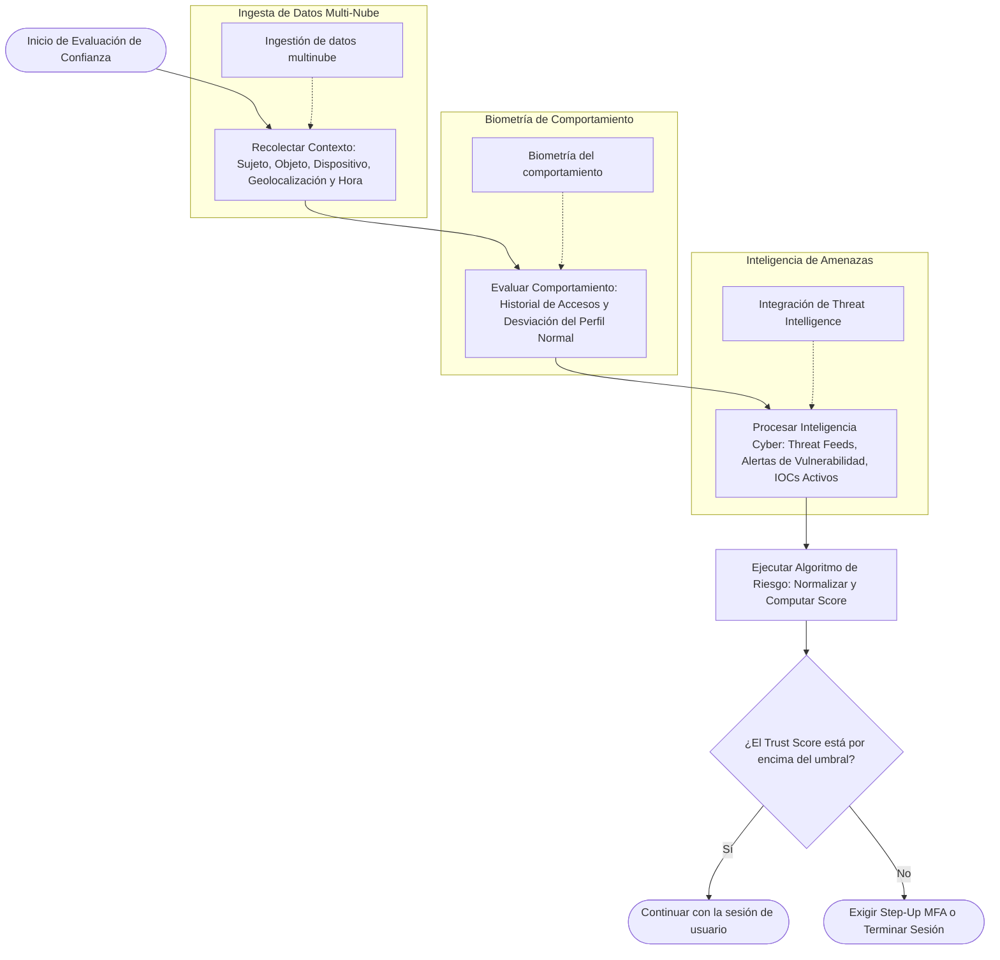
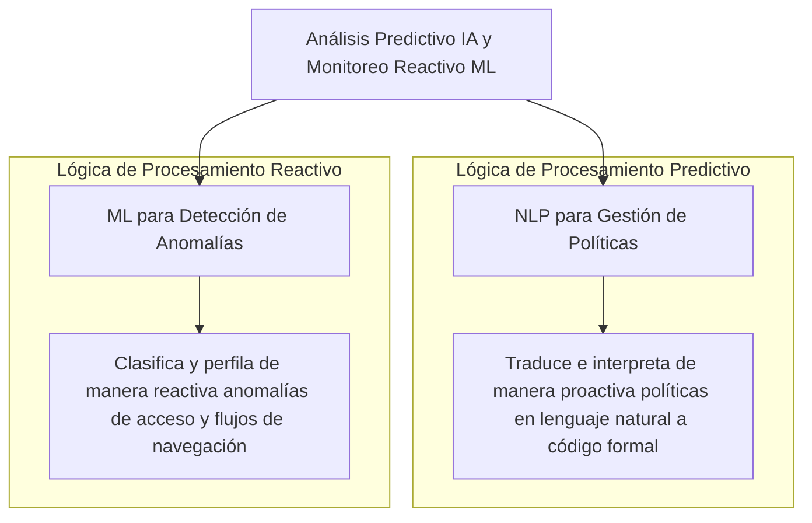
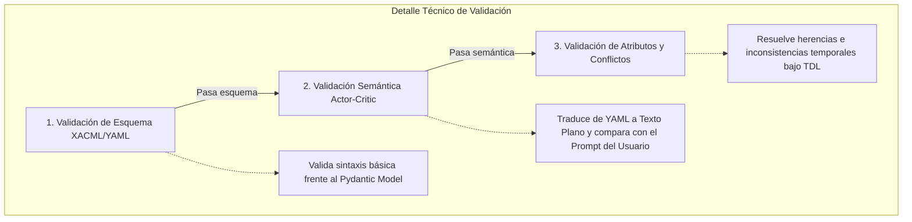
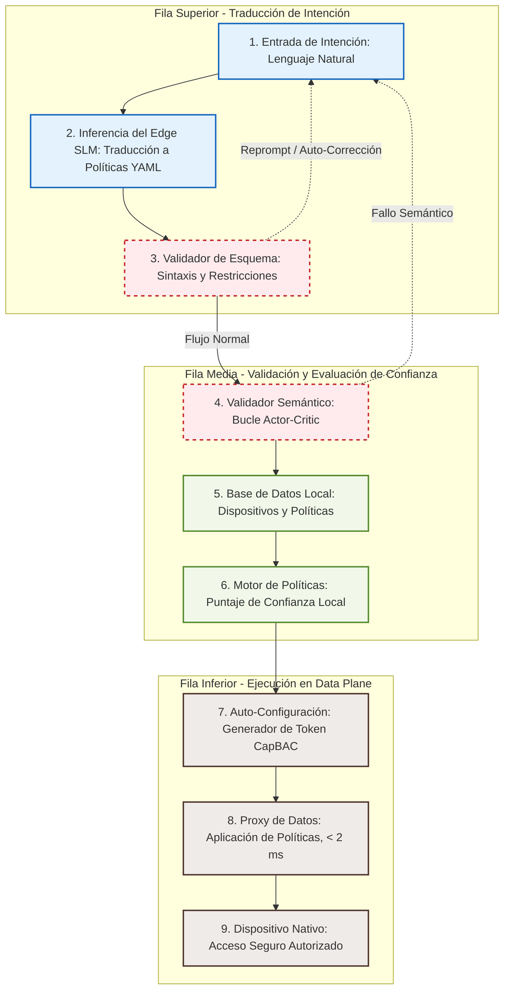
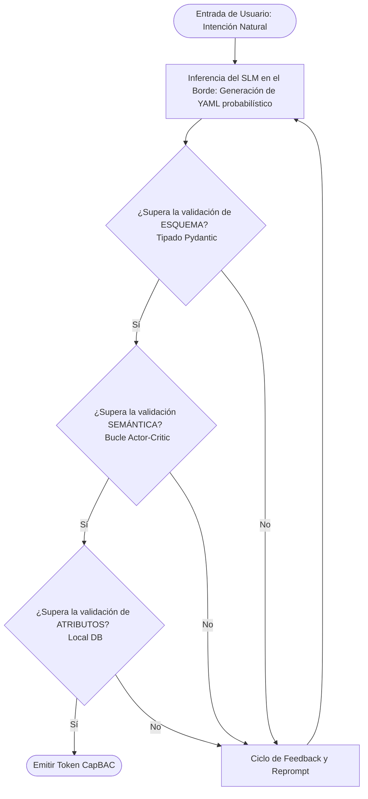
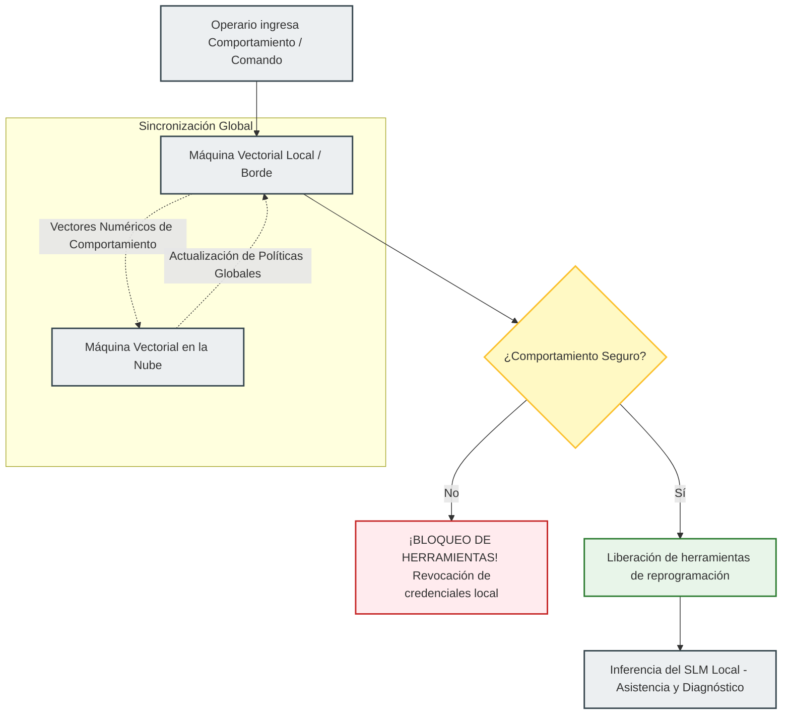

# Arquitectura de Referencia, Algoritmos de Confianza e Integración de SLM Local
## Manual Técnico de Modelado y Especificación de Ciberseguridad para Sistemas de Inteligencia Artificial (Borde/Planta)

Este documento contiene la recopilación rigurosa de la **arquitectura técnica, flujos de trabajo de ciberseguridad, diagramas modelados y ecuaciones matemáticas** de la investigación. El propósito de este manual es servir como **especificación técnica de base (Ground Truth)** para alimentar, orientar o instruir modelos de inteligencia artificial y agentes de código autónomo en el desarrollo y validación de las interfaces y servicios del sistema.

---

## 1. Estructura Completa de la Arquitectura de Software

La aplicación multiplataforma está estructurada bajo el patrón de **Clean Architecture** en combinación con **Atomic Design** y **Design Tokens** en el frontend (Flutter), y una arquitectura de **Microservicios Contenerizados** en el backend.

### 1.1 Estructura del Repositorio Frontend (Flutter)

El árbol de directorios está organizado para segregar estrictamente la lógica de negocio de los detalles de implementación visual y de datos:

```text
lib/
├── core/
│   ├── theme/
│   │   ├── design_tokens.dart  <- Átomos visuales normativos (colores industriales, espaciados táctiles).
│   │   └── app_theme.dart      <- Traduce tokens a ThemeData nativos de Flutter.
│   └── network/                <- Clientes de comunicación HTTP/WebSockets para la federación (IdP).
│
├── data/                       <- CAPA DATA: Origen de datos e implementaciones físicas.
│   ├── datasources/            
│   │   ├── local_ledger_db.dart<- Manejo de persistencia SQLite/Isar para logs inmutables locales.
│   │   └── remote_iam_api.dart <- Conexiones de API cliente con el backend centralizado (OIDC/SCIM).
│   └── repositories/           
│       └── iam_repository_impl.dart <- Implementación de la sincronización híbrida (local/nube).
│
├── domain/                     <- CAPA DOMAIN: Reglas de negocio puras (100% agnósticas a Flutter).
│   ├── entities/               
│   │   ├── user_entity.dart    <- Definición del perfil de usuario y sus privilegios/claims (SoD).
│   │   └── log_block.dart      <- Estructura formal de un bloque enlazado del Ledger criptográfico.
│   └── repositories/           
│       └── iam_repository.dart <- Contratos de interfaces abstractas.
│
└── presentation/               <- CAPA PRESENTATION: Componentes de UI y gestores de estado (BLoC).
    ├── design_system/          <- Implementación de la metodología Atomic Design (Visual).
    │   ├── atoms/              <- Botones de paro de emergencia, indicadores de estado LED, inputs.
    │   ├── molecules/          <- Tarjetas de logs de auditoría, combos de inicio de sesión con MFA.
    │   └── organisms/          <- Menú lateral de IOC, cuadrícula interactiva de control de planta.
    │
    └── modules/                <- Las 5 interfaces de tesis con BLoC integrado.
        ├── ioc/                <- Identity Orchestrator Center: Administración centralizada (SCIM).
        │   ├── bloc/           <- ioc_bloc.dart (gestión de eventos de aprovisionamiento CRUD).
        │   └── ioc_screen.dart <- Pantalla de visualización y monitoreo administrativo.
        ├── studio/             <- Windows Desktop App para diseño de plantillas e inyección local.
        │   ├── bloc/           <- studio_bloc.dart (generación de variables y empaquetado serializado).
        │   └── studio_screen.dart
        ├── loader/             <- Dispositivo móvil para inyección de binarios en PLC vía BLE.
        │   ├── bloc/           <- loader_bloc.dart (intercepción SoD e inyección secuencial BLE).
        │   └── loader_screen.dart
        └── toolbox/            <- Interfaz táctil de planta para asistencia guiada por SLM local.
            ├── bloc/           <- toolbox_bloc.dart (consumo de cliente MCP y estados de sensores).
            └── toolbox_screen.dart
```

### 1.2 Arquitectura del Backend y Microservicios (Docker/PostgreSQL)

El backend opera como un ecosistema de microservicios contenerizados distribuidos mediante Docker, asegurando el desacoplamiento de funciones críticas:

```mermaid
graph TD
    subgraph Cliente Multiplataforma (Flutter)
        IOC[Identity Orchestrator Center]
        Loader[Loader BLE Device]
        Toolbox[Toolbox AI Assistant]
        Studio[Studio Desktop App]
    end

    subgraph Backend Containerized Ecosystem
        Gateway[API Gateway / Federated Proxy]
        IdP[Identity & Auth Service]
        SCIM[SCIM Provisioning Service]
        SoD[SoD Policy Engine]
        Ledger[Cryptographic Ledger Service]
        Ollama[Ollama Local Inference Service]
    end

    subgraph Capa de Persistencia
        Postgres[(PostgreSQL DB / Replica)]
        LocalSQLite[(SQLite Local / Device Ledger)]
    end

    %% Flujos de Comunicación
    IOC -->|API REST / JSON| Gateway
    Loader -->|JWT/BLE Status| Gateway
    Toolbox -->|MCP JSON-RPC| Ollama
    Studio -->|OIDC Login| Gateway

    Gateway -->|Auth Context| IdP
    Gateway -->|Provision| SCIM
    Gateway -->|Validate Action| SoD
    Gateway -->|Write Audit| Ledger

    IdP --> Postgres
    SCIM --> Postgres
    SoD --> Postgres
    Ledger --> Postgres
    
    Loader -.->|Offline Sync| LocalSQLite
    Toolbox -.->|Offline Verification| LocalSQLite
```

---

## 2. Modelado de Diagramas de Flujo y Procesos Técnicos

A continuación, se presentan las traducciones en diagramas **Mermaid** de todas las imágenes técnicas del documento, acompañadas de su explicación detallada y su funcionamiento de bajo nivel.

### 2.1 Flujo de Evaluación de Confianza (Image 1 / Fig 1)

Este diagrama representa el motor dinámico de evaluación de la arquitectura Zero Trust. La confianza no se asume por defecto; se calcula y verifica continuamente en función de múltiples señales contextuales y conductuales.



#### Funcionamiento Técnico Paso a Paso:
1. **Ingesta e Intercepción**: Cada vez que un operario o técnico solicita acceso a un activo físico en el piso de producción (como un PLC), el Punto de Aplicación de Políticas (PEP) intercepta la petición y activa el flujo.
2. **Normalización del Contexto**: El sistema lee las variables del entorno $C_{context}(t)$ de manera activa, cruzando información de redes multi-nube y locales.
3. **Análisis Conductual**: Se compara la biometría activa (cadencia de tecleo, velocidad de clics en la terminal) y el historial de transacciones con la base de datos de comportamiento normal del usuario, generando el factor $B_{biom}(u,t)$.
4. **Enriquecimiento con Inteligencia de Amenazas**: Se consultan Indicadores de Compromiso (IOCs) activos y se valida la postura de seguridad del endpoint.
5. **Cálculo del Score**: El motor de riesgo evalúa de manera determinista la función paramétrica lineal de confianza. Si el puntaje resultante es menor que el umbral de tolerancia $	au_{seguridad}$, se escala a un método de autenticación resistente a phishing (FIDO2) o se corta la sesión de forma inmediata.

---

### 2.2 Análisis Predictivo e IA vs Detección de Anomalías con ML (Image 2 / Fig 2)

Este diagrama modela la separación de responsabilidades dentro del plano de análisis cognitivo de seguridad: por un lado, la generación y administración de políticas (IA); por otro, el monitoreo reactivo y heurístico (ML).



#### Funcionamiento Técnico Paso a Paso:
*   **NLP para Gestión de Políticas (Eje Proactivo/IA):** Permite a los analistas de seguridad de TI definir intenciones en lenguaje natural (ej: *"Permitir que el técnico de turno de mañana modifique las variables de calibración de la máquina 4 si no ha aprobado firmwares en este ciclo"*). El SLM procesa la instrucción y la compila de forma autónoma en una directiva YAML estrictamente tipada bajo el estándar de control de acceso por capacidades (CapBAC).
*   **ML para Detección de Anomalías (Eje Reactivo/ML):** Utiliza algoritmos de clasificación supervisada (como Máquinas de Vectores de Soporte locales - SVM) para contrastar de manera reactiva las acciones de piso con la línea base operativa, identificando ráfagas inusuales de comandos o movimientos laterales.

---

### 2.3 Validación Trilateral de Tres Fases (Image 3 / Fig 5)

Este es el mecanismo de contención lógica diseñado para anular las alucinaciones probabilísticas de la inteligencia artificial. Antes de aplicar una política generada por el SLM, el sistema la somete a tres filtros deterministas de validación.



#### Funcionamiento Técnico Paso a Paso:
1. **Validación Sintáctica ($
u_{esquema}$)**: El archivo YAML generado por el SLM en el borde es parseado por el framework Pydantic de Python. Si faltan campos estructurales (como `subject`, `resource`, `action` o la firma criptográfica), el validador rechaza el archivo de inmediato y ejecuta un reprompt.
2. **Validación Semántica ($
u_{semántica}$)**: Un agente secundario (o plantilla de prompts de control) traduce de forma inversa la política YAML a lenguaje natural y calcula la similitud semántica con la instrucción inicial del usuario. Esto detecta la sobre-permisividad de accesos por alucinación.
3. **Validación de Atributos y Conflictos ($
u_{atributos}$)**: Se realiza una consulta estricta de herencia en la base de datos de políticas locales. Se evalúa bajo Lógica Defectible Temporal (TDL-RGTA) que la nueva regla no rompa la matriz de segregación de funciones (SoD) o genere contradicciones con políticas preexistentes.

---

### 2.4 Estructura y Validación de Políticas (CollabIoT Pipeline) (Image 4 / Fig 3)

Este diagrama representa la tubería integral de procesamiento desde la entrada del lenguaje natural en planta hasta el aprovisionamiento de tokens de capacidad locales.



#### Funcionamiento Técnico Paso a Paso:
1. El operario ingresa su intención en lenguaje natural en la interfaz **Toolbox** local [157].
2. El **SLM local** genera el esquema YAML probabilístico con los tokens de capacidad requeridos [158].
3. El **Validador de Esquema** comprueba los tipos de datos. Si detecta fallos, detona un bucle autónomo de reprompt hacia la capa del SLM [158].
4. Si pasa la sintaxis, el **Validador Semántico** comprueba que no existan alucinaciones que amplíen los accesos [158].
5. Se consulta la base de datos PostgreSQL/SQLite local con las políticas activas de la máquina [156, 159].
6. El **Motor de Políticas** ejecuta el algoritmo de evaluación de confianza $TS_{local}(u,t)$ [159].
7. Si el resultado es exitoso, el orquestador genera el **Token CapBAC** firmado localmente con llaves asimétricas Ed25519 [159].
8. El **Proxy de Datos** ligero en el borde procesa el token de manera ininterrumpida en menos de 2 ms [160].
9. El **Dispositivo Nativo** (brazo robótico, PLC) ejecuta la acción autorizada con un aislamiento absoluto frente a redes externas [160].

---

### 2.5 Diagrama de Flujo de Evaluación de Confianza Offline (Image 5 / Fig 4)

Este flujograma lógico detalla la toma de decisiones deterministas implementada en el firmware del controlador de borde para soportar operaciones sin conectividad a la nube.



#### Funcionamiento Técnico Paso a Paso:
Este diagrama muestra que si cualquiera de los tres filtros de la validación trilateral de políticas falla (`No`), el sistema no interrumpe al usuario ni detona una alerta de intrusión falsa. En su lugar, ingresa de manera automática al **Ciclo de Feedback y Reprompt**, el cual reinyecta el código con el error formateado al SLM local para que este genere una nueva propuesta de política corregida. Este ciclo se repite hasta que se cumpla el producto lógico booleano de validación [152].

---

## 3. Formulación y Modelado Matemático de Ecuaciones

Este apartado proporciona la descripción rigurosa de las ecuaciones del sistema, definiendo sus variables, constantes, límites e impacto en la confiabilidad operativa.

### 3.1 Métrica MTTD (Tiempo Medio de Detección)

$$MTTD = rac{\sum_{i=1}^{N} (T_{detección,i} - T_{inicio,i})}{N}$$

#### Parámetros y Variables:
*   $T_{inicio,i}$: Marca de tiempo (*timestamp*) UNIX exacta del momento en que se inicia o ejecuta un incidente de seguridad $i$ (ej. una intrusión por suplantación o manipulación de firmware).
*   $T_{detección,i}$: Marca de tiempo UNIX en la que los algoritmos de detección o el equipo de analistas de seguridad de TI identifican y catalogan formalmente el incidente $i$.
*   $N$: Número total de incidentes identificados durante el periodo de evaluación de la planta.
*   **Constantes/Límites**: $N \ge 1$; $T_{detección,i} \ge T_{inicio,i}$. El MTTD óptimo en un entorno Zero Trust asistido por agentes locales debe aproximarse a los **milisegundos** de forma autónoma.

#### Aplicación de Negocio:
Mide la velocidad de descubrimiento de anomalías. Al integrar algoritmos de aprendizaje profundo en la pasarela local, el MTTD disminuye significativamente, comprimiendo los tiempos de exposición y reduciendo el *dwell time* del atacante en el piso de producción [140].

---

### 3.2 Métrica MTTR (Tiempo Medio de Respuesta)

$$MTTR = rac{\sum_{i=1}^{N} (T_{resolución,i} - T_{detección,i})}{N}$$

#### Parámetros y Variables:
*   $T_{resolución,i}$: Marca de tiempo UNIX exacta en la que el sistema afectado por el incidente $i$ ha sido completamente mitigado, parcheado y devuelto a su estado de operación segura normal.
*   $T_{detección,i}$: Marca de tiempo UNIX en la que comenzó formalmente la fase de investigación y triaje del incidente $i$.
*   $N$: Número total de incidentes mitigados de forma exitosa en el periodo de análisis.
*   **Constantes/Límites**: $N \ge 1$; $T_{resolución,i} \ge T_{detección,i}$.

#### Aplicación de Negocio:
Mide la eficiencia operativa para contener vulneraciones. En el proyecto, se automatiza mediante agentes de IA y flujos de trabajo dinámicos (SOAR Playbooks) que de forma autónoma revocan credenciales o aíslan redes vulneradas en milisegundos [141].

---

### 3.3 Algoritmo de Confianza Local Adaptativo ($TS_{local}$)

$$TS_{local}(u, t) = lpha \cdot H_{hist}(u) + eta \cdot C_{context}(t) + \gamma \cdot B_{biom}(u, t) - \lambda \cdot R_{anomaly}(u, t)$$

#### Parámetros y Variables:
*   $u$: Identificador único del usuario (sujeto) u operario en planta.
*   $t$: Instante de tiempo o marca de tiempo en la que se ejecuta la transacción de acceso.
*   $H_{hist}(u) \in [0, 1]$: Factor de historial local del usuario. Mide la tasa de transacciones seguras previas y ejecuciones de calibración autorizadas por el operario, almacenadas localmente en la base de datos relacional Postgres replicada.
*   $C_{context}(t) \in [0, 1]$: Coherencia del contexto. Evalúa si la subred de conexión de la terminal, los puertos físicos utilizados y el turno de trabajo coinciden con las ventanas de acceso históricas de la máquina.
*   $B_{biom}(u, t) \in [0, 1]$: Factor biométrico conductual y de telemetría de red. Analiza la velocidad y cadencia de clics en la interfaz Flutter y la frecuencia de consultas de telemetría.
*   $R_{anomaly}(u, t) \in [0, 1]$: Término de penalización por riesgo. Es un valor acumulativo calculado por las Máquinas de Vectores de Soporte locales (SVM) que representa la desviación cuantitativa de la línea base conductual del operario.
*   $lpha, eta, \gamma, \lambda$: Coeficientes de ponderación paramétrica que determinan la sensibilidad del motor a cada factor de riesgo.
*   **Restricción Matemática**: $lpha, eta, \gamma, \lambda \ge 0$ y se cumple estrictamente la normalización de la suma ponderada: 
    $$lpha + eta + \gamma = 1$$

#### Aplicación de Negocio:
Permite a los gateways de planta tomar decisiones de control de acceso dinámico de manera 100% autónoma y en modo offline sin realizar consultas por internet a servidores de nube [147].

---

### 3.4 Decisión de Emisión de Token CapBAC

$$Decisión(u, Recurso, Acción) = egin{cases} 	ext{Emitir Token CapBAC} & 	ext{si } TS_{local}(u, t) \ge 	au_{seguridad} \land 
u_{pipeline}(
ho_{yaml}) = 1 \ 	ext{Denegar / Step-up} & 	ext{en cualquier otro caso} \end{cases}$$

#### Parámetros y Variables:
*   $Recurso$: El elemento físico u objeto lógico sobre el que se quiere operar (ej. Brazo Robótico KUKA, PLC calibrador).
*   $Acción$: La transacción técnica que se desea ejecutar (ej. `write_firmware`, `read_sensors`).
*   $	au_{seguridad}$: Umbral de seguridad requerido. Es la cota mínima de confianza tolerada para interactuar con el recurso. Recursos críticos de inyección de software exigen un $	au_{seguridad} 	o 1$.
*   $
u_{pipeline}(
ho_{yaml})$: Resultado booleano determinista de la función de validación trilateral que analiza la sintaxis y semántica de la política YAML $
ho_{yaml}$ generada por el SLM.
*   **Constantes/Límites**: $	au_{seguridad} \in [0, 1]$; $
u_{pipeline} \in \{0, 1\}$.

#### Aplicación de Negocio:
Establece una barrera matemática e inquebrantable de autorización por capacidades en el borde (CapBAC). Si el puntaje de confianza calculado es menor al umbral de seguridad, el sistema deniega el acceso automáticamente (Principio *Deny-by-Default*) o exige un segundo factor de autenticación física [149].

---

### 3.5 Función de Validación Trilateral del Borde ($
u_{pipeline}$)

$$
u_{pipeline}(
ho_{yaml}) = 
u_{esquema}(
ho_{yaml}) \land 
u_{semántica}(
ho_{yaml}, Prompt_{usuario}) \land 
u_{atributos}(
ho_{yaml}, DB_{local})$$

#### Sub-funciones Componentes:
1.  **Validación de Esquema ($
u_{esquema}$):**
    $$
u_{esquema}(
ho_{yaml}) = \prod (Campos(
ho_{yaml}) \subseteq Esquema_{Pydantic} \land Tipos_{esquema})$$
    Asegura que el YAML generado cuente con los atributos y el tipado estricto del esquema definidos por el sistema.
2.  **Validación Semántica ($
u_{semántica}$):**
    $$
u_{semántica}(
ho_{yaml}, Prompt_{usuario}) = \prod (Similitud_{Semántica}(TraducirToTexto(
ho_{yaml}), Prompt) > 	heta_{umbral})$$
    Donde $	heta_{umbral}$ es el límite de similitud semántica tolerable (ej: $	heta_{umbral} \ge 0.85$). Compara la política traducida con la intención inicial del usuario en lenguaje natural para prevenir alucinaciones que otorguen permisos de más.
3.  **Validación de Atributos y Conflictos ($
u_{atributos}$):**
    Cruza los datos de las variables generadas con la base de datos de dispositivos locales ($DB_{local}$), y evalúa las reglas dinámicas de la matriz de segregación de funciones (SoD) mediante Lógica Defectible Temporal (TDL-RGTA) para impedir colisiones de herencia o conflictos de rol [112, 156].

#### Aplicación de Negocio:
Garantiza que la autoconfiguración de políticas de acceso industrial habilitada por el SLM en el borde no introduzca vulnerabilidades de sobre-permisividad o errores de compilación lógica en los equipos industriales [153].

---

## 4. Flujos de Trabajo en Piso de Producción y Asistencia de SLM Local

El ecosistema separa de forma estricta las tareas de **análisis cuantitativo de seguridad** (las cuales se ejecutan de manera matemática y determinista por Máquinas Vectoriales en Borde y Nube) de las tareas de **asistencia cualitativa** (guiadas por el SLM de manera local).



### 4.1 El Control de Acceso y Comportamiento (Las Máquinas Vectoriales)
1.  **Máquina Vectorial Local (Borde):** Opera en la pasarela física conectada a la maquinaria industrial. Analiza de forma matemática y en tiempo real el comportamiento numérico de la sesión (ej: la secuencia de clics, velocidad de consultas en bus serial o intentos de lectura no autorizados). Si detecta un desvío, bloquea el canal de comunicación o el hardware en menos de 10 milisegundos, sin consultar a internet.
2.  **Máquina Vectorial en la Nube (Global):** Centraliza de manera asíncrona los vectores numéricos de telemetría de comportamiento de todas las plantas corporativas. Evalúa anomalías cruzadas de fraude o hackeo coordinado a nivel de red y actualiza de manera constante las políticas generales que se replican hacia los bordes locales [177].

### 4.2 La Asistencia Técnica (El SLM Local Únicamente)
*   **Inferencia 100% Local:** Para eliminar costos de APIs de IA generativa y latencias de conexión crítica (~1800 ms), el sistema aloja un Modelo de Lenguaje Pequeño (SLM) de parámetros optimizados (entre 0.5B y 2B) cuantizado a 2 o 4 bits de forma local en la memoria de la pasarela física.
*   **Flujo Interceptivo Basado en SoD:** El SLM no tiene la facultad de bloquear el hardware de forma directa, garantizando una arquitectura robusta contra la inyección de prompts. El SLM actúa exclusivamente como traductor técnico y guía operativo (ej: *"El firmware que estás intentando cargar es la versión de software de calibración incorrecta para este PLC"*).
*   **Dependencia Estricta del Plano de Control:** El SLM local solo se activa, renderiza la interfaz **Toolbox** y presenta asistencia si y solo si las máquinas vectoriales de control han validado y mantenido activo el acceso del operario, cumpliendo el principio fundamental de Zero Trust.
