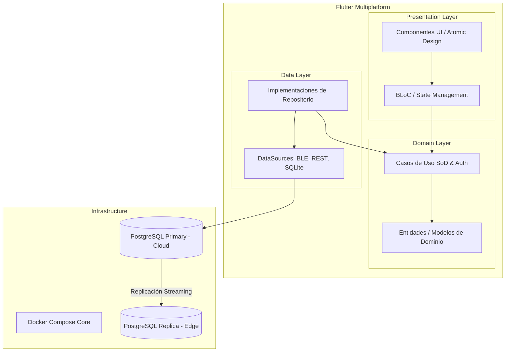
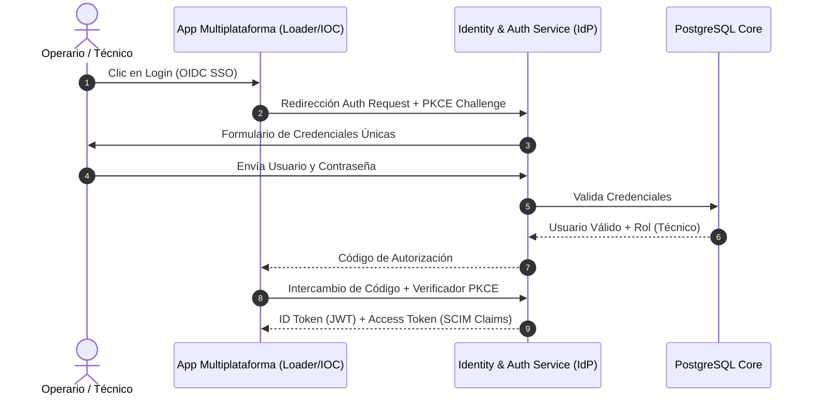
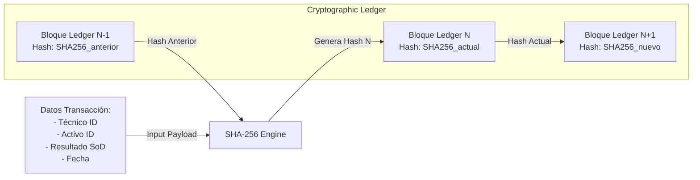
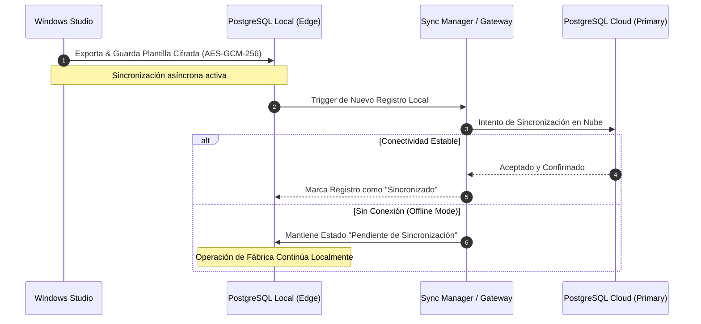
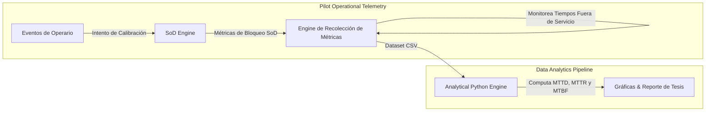
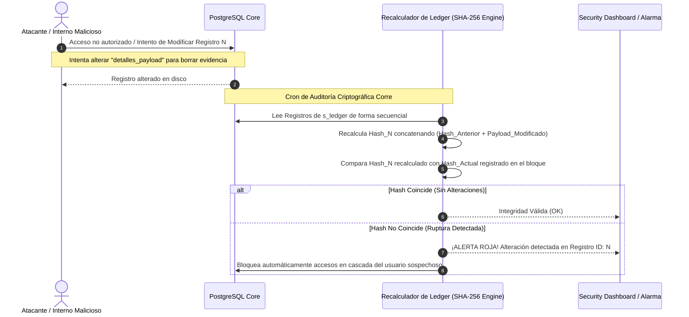
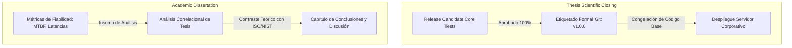

# DOCUMENTO MAESTRO DE ORQUESTACIÓN Y DESARROLLO (SDD)
## Sistema de Gobernanza de IA Local y Gestión de Identidad (IAM) con Segregación de Funciones (SoD)
### Tesis Recepcional - Universidad Tecnológica de Querétaro (UTEQ)
**Presenta:** Erik Israel González Guerrero  
**Director de Tesis:** Dr. Jacinto Eliseo Quintana Landaverde  
**Fecha:** Agosto, 2026  
**Versión de Inicio:** `v0.0.0`

---

## 1. INTRODUCCIÓN Y MARCO OPERATIVO

Este **Documento Maestro de Orquestación y Desarrollo** actúa como la guía técnica definitiva para la implementación y documentación paso a paso del ecosistema integral de ciberseguridad industrial y gobernanza activa de IA para Smart Manufacturing. El desarrollo se rige bajo la metodología **Spec-Driven Development (SDD)**, donde cada línea de código y configuración de infraestructura se deriva directamente de las especificaciones y necesidades descritas en el documento de tesis.

### 1.1 Reglas de Control de Versiones Semántico
Cada incremento verificado de software debe etiquetarse de acuerdo con el esquema semántico `vX.Y.Z`:
* **X (Major):** Versión final de producción. Será `0` durante todo el desarrollo iterativo y se congelará en `1.0.0` al finalizar el Sprint 12.
* **Y (Minor - Sprint):** Corresponde al número de Sprint en ejecución (Sprints 0 a 12).
* **Z (Patch - Bug/Mejora):** Incrementos pequeños para parches de errores o refinamientos específicos dentro del mismo Sprint.

### 1.2 Flujo de Trabajo SDD en Opencode
Para asegurar la reproducibilidad e integridad del repositorio, cada componente dentro de los sprints sigue este ciclo de vida:
1. **Input del Spec:** Se mapea directamente con la sección del entregable de tesis.
2. **Historia de Vida:** Se documenta el caso de uso con su contexto de negocio, objetivos técnicos, roles involucrados e implicaciones de seguridad.
3. **Diagrama Mermaid:** Planificación visual de la lógica antes de programar.
4. **Prompt de Opencode:** Instrucción de automatización directa lista para ser ejecutada en el asistente de código.
5. **Validación y Commit:** Comando de terminal para el control de versiones local tras la confirmación manual de que la funcionalidad cumple los criterios de aceptación.

---

## FASE I: CIMIENTOS, INTERFACES Y ARQUITECTURA CORE

### SPRINT 0: Investigación, Cimientos y Sistema de Diseño (27 Oct - 12 Nov)

#### A. Historia de Vida (User Story)
* **Como:** Ingeniero de Ciberseguridad y Arquitecto de Software,
* **Quiero:** Inicializar el monorrepo multiplataforma en Flutter estructurado bajo Clean Architecture, configurar los Design Tokens visuales normativos y levantar la persistencia local/nube réplica en Docker con PostgreSQL,
* **Para:** Garantizar una base sólida y reproducible sobre la cual heredar de forma segura las restricciones de control de acceso y Segregación de Funciones (SoD) en todas las interfaces de usuario.
* **Contexto Industrial:** La planta requiere que los colores reflejen normativas de seguridad física (amarillo de advertencia para fallos, rojo para bloqueos SoD, azul para asistencia de IA). El desacoplamiento estructural entre las capas de Datos, Dominio y Presentación previene que la manipulación visual altere los mecanismos lógicos de seguridad.

#### B. Planificación Visual (Mermaid)


#### C. Prompt de Automatización para Opencode
```text
Role: Principal Multiplatform Architect & Docker Specialist
Task: Inicializar el monorrepo unificado en Flutter bajo Clean Architecture y configurar el backend contenerizado.

Instrucciones detalladas de automatización:
1. Generar la estructura de carpetas de Flutter bajo Clean Architecture para un monorrepo unificado:
   - lib/core/theme/ (Design Tokens: colores, tipografías y espaciados basados en normas industriales).
   - lib/features/auth/ (presentation/bloc, domain/entities, domain/usecases, data/datasources, data/repositories).
   - lib/features/loader/ (capa de presentación y datos para la inyección de firmware).
2. Crear un archivo 'lib/core/theme/design_tokens.dart' con:
   - Colores: SafetyRed (#DC3545) para bloqueos SoD, WarningYellow (#FFC107) para advertencias de calibración, GovBlue (#0D6EFD) para el agente de IA, SafeGreen (#198754) para accesos autorizados.
   - Tamaños táctiles para tablets industriales (mínimo 48dp de área de contacto).
3. Generar un archivo 'docker-compose.yml' en la raíz con dos servicios:
   - db_primary (PostgreSQL 16) puerto 5432.
   - db_replica (PostgreSQL 16) puerto 5433 en modo de réplica de lectura para simular el comportamiento offline híbrido.
4. Incluir un script 'init-replication.sh' para configurar de forma automatizada la replicación en streaming física entre ambos contenedores PostgreSQL.

Escribe todo el código en formato modular y limpio, listo para compilar. No utilices placeholders.
```

#### D. Instrucción de Commit y Versionamiento
Tras validar la estructura de directorios y comprobar que `docker-compose up -d` inicializa ambos contenedores con réplica activa, ejecutar en la terminal de Opencode:
```bash
git init
git add .
git commit -m "feat(sprint-0): init clean architecture in flutter, design tokens and replication postgres docker v0.0.0"
git tag -a v0.0.0 -m "Release Sprint 0 Core Base"
```

---

### SPRINT 1: UI Multiplataforma e Infraestructura IAM (13 Nov - 10 Dic)

#### A. Historia de Vida (User Story)
* **Como:** Administrador de Sistemas de Identidad,
* **Quiero:** Compilar las versiones Alpha funcionales de la aplicación móvil (APK) y escritorio (Windows EXE), diseñar las pantallas funcionales del Loader ("Checklist de Producción") y del IOC (Panel de control administrativo), e integrar el inicio de sesión federado utilizando OpenID Connect (OIDC) y aprovisionamiento SCIM,
* **Para:** Consolidar los diez puntos de acceso independientes actuales en una identidad federada centralizada y segura.
* **Contexto Industrial:** Se elimina la dispersión técnica y el almacenamiento manual de credenciales locales. El operario de piso inicia sesión una sola vez contra el IdP federado y obtiene un ID Token unificado en formato JWT que contiene su rol (Técnico, Operador, etc.).

#### B. Planificación Visual (Mermaid)


#### C. Prompt de Automatización para Opencode
```text
Role: IAM Security Engineer & Flutter BLoC Developer
Task: Implementar el flujo de autenticación OIDC/OAuth 2.0 con PKCE en Flutter y maquetar las vistas base para IOC y Loader.

Instrucciones de desarrollo:
1. Agregar las dependencias necesarias de Flutter en pubspec.yaml: flutter_bloc, flutter_secure_storage, yopenid_client.
2. Desarrollar el archivo 'lib/features/auth/domain/entities/user_identity.dart' con propiedades: id, username, email, active, rol (enum: SuperUsuario, Administrador, Tecnico, Operador, Externo).
3. Implementar el 'lib/features/auth/presentation/bloc/auth_bloc.dart' con estados: AuthInitial, AuthLoading, Authenticated(UserIdentity), Unauthenticated, AuthError.
4. Crear la vista 'lib/features/loader/presentation/pages/checklist_page.dart': un formulario estructurado con casillas de verificación táctiles de alta visibilidad para que el Técnico apruebe los pasos de seguridad antes del flasheo de tarjetas.
5. Diseñar la vista 'lib/features/ioc/presentation/pages/ioc_dashboard_page.dart' en Flutter Desktop para administración: un panel lateral que muestre la lista de usuarios y roles simulados mediante estados dummy controlados por el BLoC de autenticación.
6. Configurar la integración OIDC básica simulada en el data source de auth, asegurando que un login exitoso emita un JWT con los claims correspondientes al rol.

Todo el código generado debe compilar limpiamente tanto para Android como para Windows.
```

#### D. Instrucción de Commit y Versionamiento
Tras compilar con éxito la APK y el EXE de Windows (`flutter build apk --debug` y `flutter build windows --debug`), y verificar que la redirección simulada de OIDC emite los tokens correctos:
```bash
git add .
git commit -m "feat(sprint-1): compilation of alpha apk/exe, maquetation of ioc/loader and oidc auth bloc v0.1.0"
git tag -a v0.1.0 -m "Release Sprint 1 UI & Federated IAM"
```

---

### SPRINT 2: Conectividad y Matriz SoD Inicial (11 Dic - 15 Ene)

#### A. Historia de Vida (User Story)
* **Como:** Técnico de Mantenimiento de Piso de Producción,
* **Quiero:** Conectarme físicamente mediante Bluetooth Low Energy (BLE) a las tarjetas de calibración de maquinaria utilizando la interfaz Loader, y verificar que mis intentos de reprogramación pasen por un motor lícito de Segregación de Funciones (SoD) que bloquee en milisegundos solicitudes de usuarios incompatibles,
* **Para:** Evitar que un único operador que programó o aprobó un cambio de firmware sea el mismo que inyecte de manera imprudente el archivo binario (`.bin`), minimizando así sabotajes u omisiones de validación en la planta.
* **Contexto Industrial:** La separación de funciones se computa en el backend mediante el SoD Policy Engine. Se previene que un técnico que posea privilegios cruzados de desarrollo y operaciones altere la lógica de control crítico.

#### B. Planificación Visual (Mermaid)
```mermaid
flowchart TD
    subgraph Loader Mobile (Flutter)
        User[Técnico en Piso] -->|Inicia Inyección de .bin| BLoC[Loader BLoC]
        BLoC -->|Escanea & Conecta| BLE[BLE Data Source]
    end
    subgraph Microservices (Docker Backend)
        Backend[Backend Gateway] -->|Consulta Autorización SoD| SoD[SoD Policy Engine]
        SoD -->|Evalúa Reglas de Incompatibilidad| DB[(PostgreSQL)]
    end
    BLE -->|Petición de Conexión BLE| Activo[Activo Físico / Tarjeta Electrónica]
    BLoC -->|Verifica Privilegios en API| Backend
    SoD -->|Fallo SoD / Conflicto de Roles| Backend -->|Retorna Bloqueo 403| BLoC -->|Muestra Alerta Roja de Violación SoD| User
```

#### C. Prompt de Automatización para Opencode
```text
Role: Cyber-Physical Systems Developer & PostgreSQL Architect
Task: Implementar la capa BLE de comunicación en Flutter y el SoD Policy Engine en el backend con Postgres.

Especificaciones Técnicas:
1. Generar el script SQL definitivo 'database/sod_schema.sql':
   - Tabla 'usuarios' (id, username, rol_principal).
   - Tabla 'matriz_sod' (rol_origen, rol_incompatible, operacion_bloqueada).
   - Insertar reglas de exclusión mutua: 'Tecnico' es incompatible con 'Administrador' para la inyección de firmwares críticos de calibración.
   - Tabla 'ordenes_trabajo' (id, creado_por, aprobado_por, estado).
2. Desarrollar el microservicio SoD Policy Engine en Node.js (Express) o Python (FastAPI):
   - Crear un endpoint POST '/api/v1/sod/validate': recibe {usuario_solicitante_id, activo_id, firmware_id}.
   - Validar que la orden de trabajo para ese firmware y activo haya sido aprobada por un Administrador diferente al Técnico que solicita la inyección.
   - Si el solicitante es el mismo que aprobó la orden de trabajo o posee roles incompatibles, retornar HTTP 403 Forbidden con un JSON explícito describiendo la violación de Segregación de Funciones.
3. En Flutter (Loader), agregar 'flutter_blue_plus' al pubspec.yaml. Implementar 'lib/features/loader/data/datasources/ble_datasource.dart' con métodos para escanear dispositivos industriales cercanos, conectarse por UUID de servicio industrial, y transmitir un stream asíncrono de bloques de bytes del firmware (.bin).
4. El Loader BLoC debe validar primero contra el endpoint '/api/v1/sod/validate' antes de activar el botón de flasheo BLE.

Garantizar respuestas rápidas (latencia menor a 150ms).
```

#### D. Instrucción de Commit y Versionamiento
Tras verificar la conectividad de simulación BLE y comprobar que el endpoint de SoD rechaza con un HTTP 403 a usuarios que intenten auto-aprobarse órdenes de calibración:
```bash
git add .
git commit -m "feat(sprint-2): ble connectivity in loader and sod policy engine endpoint validation v0.2.0"
git tag -a v0.2.0 -m "Release Sprint 2 BLE & SoD Logic"
```

---

## FASE II: ROBUSTECIMIENTO, GESTIÓN DE DATOS Y LEDGER

### SPRINT 3: Autenticación Avanzada y Ledger Inmutable (16 Ene - 10 Feb)

#### A. Historia de Vida (User Story)
* **Como:** Oficial de Auditoría y Cumplimiento Regulatorio,
* **Quiero:** Que cada validación de identidad y decisión del motor SoD sea protegida por autenticación multifactor resistente a phishing (FIDO2) y registrada asíncronamente en una bitácora inmutable enlazada mediante hash criptográfico (SHA-256),
* **Para:** Garantizar el no repudio absoluto y blindar los registros de transacciones contra manipulaciones retrospectivas o intentos de alteración interna por usuarios con privilegios elevados.
* **Contexto Industrial:** Cumplimiento con las normas ISO/IEC 27002 e ISO/IEC 27001. Si un operario reprograma una variable crítica, el sistema computa el hash del log actual incorporando el hash del bloque de log inmediatamente anterior. Cualquier alteración de un registro histórico corrompe de manera detectable la cadena matemática.

#### B. Planificación Visual (Mermaid)


#### C. Prompt de Automatización para Opencode
```text
Role: Cryptography Specialist & Database Security Expert
Task: Desarrollar el Cryptographic Ledger Service y habilitar el MFA Phishing-Resistant en el IdP.

Especificaciones Técnicas:
1. Desarrollar el microservicio contenerizado 'Cryptographic Ledger Service' (en Node.js/Python):
   - Crear tabla 'sod_ledger' (id, timestamp, usuario_id, accion, detalles_payload, hash_anterior, hash_actual).
   - Implementar un método POST '/api/v1/ledger/record' que:
     a) Lea el hash_actual del último bloque de log registrado en la base de datos (si es el primero, usar un bloque génesis con hash predefinido).
     b) Serialice el payload actual (usuario, acción, parámetros técnicos, marca de tiempo).
     c) Calcule el nuevo Hash SHA-256 concatenando (hash_anterior + serializacion_payload).
     d) Guarde de forma transaccional el nuevo registro en 'sod_ledger'.
2. Crear un script de validación periódica 'scripts/validate_ledger.py' que recorra de manera iterativa todos los registros de la tabla 'sod_ledger', recalculando los hashes secuenciales y comparándolos para asegurar que la integridad estructural de la cadena no ha sido quebrantada (retornar 'INTEGRIDAD_VALIDA' o flagear el ID del registro corrompido).
3. Habilitar soporte conceptual/simulado para autenticación WebAuthn/FIDO2 MFA resistente a phishing dentro de la interfaz de login del IdP federado, exigiendo un pin de seguridad o verificación biométrica física tras la confirmación de credenciales.

Todo el flujo de Ledger debe procesarse de manera asíncrona mediante colas de tareas o hilos secundarios para no entorpecer los tiempos de respuesta.
```

#### D. Instrucción de Commit y Versionamiento
Tras probar que el script de validación `validate_ledger.py` detecta de manera inmediata cualquier cambio manual en la columna `detalles_payload` de un registro de base de datos intermedio:
```bash
git add .
git commit -m "feat(sprint-3): cryptographic ledger with sha-256 hashing and fido2 mfa architecture v0.3.0"
git tag -a v0.3.0 -m "Release Sprint 3 Security Audit Ledger"
```

---

### SPRINT 4: Interfaz Studio (11 Feb - 28 Feb)

#### A. Historia de Vida (User Story)
* **Como:** Ingeniero de Configuración y Diseño de Planta,
* **Quiero:** Utilizar una aplicación nativa de escritorio para Windows (Studio) estructurada visualmente bajo el modelo jerárquico de Atomic Design,
* **Para:** Configurar de manera reactiva, eficiente y sin errores visuales las variables, constantes y plantillas lógicas de la maquinaria de manufactura inteligente antes de ser empaquetadas.
* **Contexto Industrial:** El diseño atómico separa los componentes en Átomos, Moléculas y Organismos de alta reutilización. Ciertos organismos de configuración avanzada solo se instancian si el estado del BLoC confirma que el rol del diseñador posee los privilegios técnicos adecuados.

#### B. Planificación Visual (Mermaid)
```mermaid
graph TD
    subgraph Windows Studio Interface (Atomic Design)
        A1[Átomos: Botones, Inputs, Toggles de Variables]
        M1[Moléculas: Campos de Configuración de Sensores]
        O1[Organismos: Editor de Plantillas Industriales]
        T1[Plantillas: Esquema General de Configuración]
        P1[Páginas: Pantalla Completa de Studio]
    end
    subgraph UI Authorization Filter
        BlocState[BLoC State Engine]
        AdminRights{¿Posee Rol <br> Administrador/Técnico?}
    end
    P1 --> T1
    T1 --> O1
    O1 --> M1
    M1 --> A1
    O1 -->|Instanciado Seguro| BlocState
    BlocState --> AdminRights
    AdminRights -->|Sí| RenderOrganism[Renderiza Editor de Planta]
    AdminRights -->|No| BlockOrganism[Oculta Botones Críticos de Variable]
```

#### C. Prompt de Automatización para Opencode
```text
Role: Windows Desktop Flutter Engineer & Atomic UI Designer
Task: Maquetar la interfaz nativa 'Studio' para Windows utilizando Atomic Design y herencia lógica SoD.

Especificaciones Técnicas:
1. Configurar soporte nativo para compilar Flutter en la plataforma Windows Desktop.
2. Crear la biblioteca de componentes atómicos 'lib/core/ui_system/':
   - Átomos: 'custom_text_field.dart', 'safety_button.dart', 'parameter_toggle.dart'.
   - Moléculas: 'variable_row.dart' (combina nombre, unidad física e input de valor).
   - Organismos: 'template_editor_panel.dart' (un editor visual interactivo con grilla que permite agregar múltiples variables y definir su rango operativo seguro).
3. Implementar la validación condicional mediante BLoC en 'lib/features/studio/presentation/pages/studio_home_page.dart'. Si el usuario autenticado tiene el rol de 'Operador' o 'Externo', el 'template_editor_panel.dart' debe bloquear la edición de campos críticos de rango operativo de sensores (marcando los campos como read-only y aplicando el Design Token de opacidad baja/bloqueada).
4. El formulario de alta de plantillas debe ser completamente reactivo con validaciones instantáneas en tiempo real para evitar ingresos de datos fuera de rango (como valores de calibración negativos en sensores de presión).

Garantizar una experiencia fluida, adaptada a ventanas de escritorio (responsive desktop layout).
```

#### D. Instrucción de Commit y Versionamiento
Tras compilar Studio para escritorio Windows (`flutter build windows --release`) y comprobar que los usuarios sin privilegios correspondientes no pueden visualizar ni editar el panel avanzado de plantillas:
```bash
git add .
git commit -m "feat(sprint-4): windows desktop studio application layout using atomic design and reactive forms v0.4.0"
git tag -a v0.4.0 -m "Release Sprint 4 Windows Studio Layout"
```

---

### SPRINT 5: Lógica de Studio y Orquestador de Datos (01 Mar - 20 Mar)

#### A. Historia de Vida (User Story)
* **Como:** Ingeniero de Configuración de Planta,
* **Quiero:** Que las plantillas y variables que configuro en la interfaz de escritorio Studio se exporten de forma serializada, cifrada y firmada criptográficamente, sincronizándose asíncronamente con la base de datos PostgreSQL mediante un modelo de replicación híbrido (local/nube),
* **Para:** Garantizar que los operarios de piso de producción consuman las plantillas actualizadas en sus terminales locales de manera inmediata, incluso si la fábrica pierde de manera repentina la conectividad externa.
* **Contexto Industrial:** La sincronización híbrida robustece la continuidad operativa de la planta (Alta Disponibilidad Offline), manteniendo las decisiones de identidad y perfiles de activos siempre legibles en el borde.

#### B. Planificación Visual (Mermaid)


#### C. Prompt de Automatización para Opencode
```text
Role: Database Reliability Engineer & Security Specialist
Task: Desarrollar el generador de plantillas serializadas con cifrado AES-256 en Studio e implementar el gestor de sincronización híbrida en Postgres.

Especificaciones Técnicas:
1. En Flutter Studio, implementar un servicio 'lib/features/studio/data/services/configuration_serializer.dart' que tome las variables de la plantilla, las serialice en formato JSON compacto y aplique un cifrado simétrico robusto utilizando AES-GCM de 256 bits (utilizando una clave simétrica de fábrica autorizada).
2. En el backend PostgreSQL, definir un esquema 'sync_schema.sql' con una columna 'sync_status' (enum: SYNCHRONIZED, PENDING_SYNC) y 'last_modified' en todas las tablas críticas (usuarios, matriz_sod, plantillas_config).
3. Desarrollar un servicio ligero de sincronización en Python/Go ('services/data_sync_orchestrator.py') que:
   - Se ejecute de forma persistente en el nodo de borde local (Edge).
   - Monitoree registros locales con estado 'PENDING_SYNC'.
   - Intente de forma periódica (cada 10 segundos) enviarlos a la base de datos central en la nube.
   - Maneje con gracia los errores de red por caída de Internet, aplicando un algoritmo de reintento exponencial (exponential backoff) para no saturar los servicios al reestablecer la conexión.
4. Generar el manual técnico preliminar en formato markdown describing el proceso de serialización y la estrategia de tolerancia a caídas de red.

Todo el código de base de datos debe contemplar bloqueos optimistas para evitar colisiones de concurrencia.
```

#### D. Instrucción de Commit y Versionamiento
Tras validar la lógica de cifrado AES-GCM y probar que la desconexión física de la red en el servidor local de base de datos mantiene las transacciones activas de forma local para sincronizarlas al reconectar:
```bash
git add .
git commit -m "feat(sprint-5): aes-gcm encrypted configuration serialization and postgres hybrid synchronization manager v0.5.0"
git tag -a v0.5.0 -m "Release Sprint 5 Sincronización & Cifrado"
```

---

## FASE III: GOBERNANZA INTELIGENTE LOCAL Y RESILIENCIA

### SPRINT 6: Gobernanza Agéntica Local (27 Abr - 05 May)

#### A. Historia de Vida (User Story)
* **Como:** Operario de Planta Asistido por Inteligencia Artificial,
* **Quiero:** Que un modelo de lenguaje pequeño (SLM) cuantizado y desplegado localmente a través de Ollama se comunique de forma segura mediante el protocolo Model Context Protocol (MCP) para analizar las variables físicas de la máquina en tiempo real, de modo que intercepte y bloquee de forma autónoma inyecciones de código incompatibles con la matriz SoD directamente en mi interfaz Toolbox móvil,
* **Para:** Validar y certificar con precisión matemática cada calibración en el piso de producción, protegiendo los activos críticos incluso en ausencia de conexión a Internet.
* **Contexto Industrial:** Cumplimiento con la norma ISO/IEC 23894 para el aislamiento local de IA. La gobernanza de la IA local asegura que el diagnóstico técnico no dependa de APIs costosas y lentas en la nube externa (~1500ms), logrando respuestas eficientes y soberanas en menos de 150ms en el borde físico de la fábrica.

#### B. Planificación Visual (Mermaid)
```mermaid
graph TD
    subgraph Toolbox Mobile App (Flutter)
        User[Operario] -->|Solicita Calibración / Inyección| ToolBloc[Toolbox BLoC]
        ToolBloc -->|Consulta Contexto y Acción| MCPClient[Cliente MCP]
    end
    subgraph Edge AI Server (Ollama Local Node)
        MCPClient -->|Llamada de Herramienta MCP| MCPServer[MCP Server]
        MCPServer -->|Inferencia de Seguridad| SLM[Ollama Local SLM <br> Gemma 3 2B Q4_K_M]
        SLM -->|Genera Directiva YAML Probabilística| Pipeline[Bucle de Validación Trilateral]
        Pipeline -->|1. Validación de Esquema Pydantic| Schema{¿Esquema Válido?}
        Pipeline -->|2. Validación Semántica Actor-Critic| Semantic{¿Semántica Válida?}
        Pipeline -->|3. Validación Atributos contra SQL| Attr{¿Atributos Coincidentes?}
        Schema & Semantic & Attr -->|Falló alguna validación| Reprompt[Ciclo de Auto-Corrección] --> SLM
        Schema & Semantic & Attr -->|Aprobado 100%| Token[Emitir Token CapBAC]
    end
    Token -->|Token Autorizado| ToolBloc -->|Ejecuta Flasheo BLE| Machine[PLC / Activo Industrial]
```

#### C. Prompt de Automatización para Opencode
```text
Role: Edge AI Specialist & MCP Integrator
Task: Desplegar el modelo SLM cuantizado en Ollama local, desarrollar el MCP Server e implementar el flujo de validación trilateral de políticas en Python.

Especificaciones Técnicas:
1. Crear un script de inicialización 'edge_ai/setup_ollama.sh' para levantar Ollama y descargar un modelo ligero optimizado (v.g. Phi-3-mini o Gemma-3-2b cuantizado a 4 bits: 'gemma:2b-instruct-q4_K_M') que se ejecute en el hardware convencional de la planta.
2. Desarrollar el servidor MCP 'edge_ai/mcp_server.py' utilizando el SDK oficial de Model Context Protocol (MCP) de Anthropic/FastMCP:
   - Exponer una herramienta 'validate_injection_policy' que reciba: {usuario_intencion_natural, hardware_modelo, matriz_sod_claims}.
   - Pasar el contexto al SLM para que traduzca la intención natural a una propuesta de política en formato YAML:
     ```yaml
     policy:
       subject_role: Tecnico
       action: WRITE_FIRMWARE
       resource: PLC_CALIBRATION_SLOT_0
       constraints: { temperature_max: 85, sod_check: PASSED }
     ```
3. Implementar de manera estricta la Función de Validación Trilateral ('edge_ai/trilateral_validator.py'):
   - Fase 1 (Validación de Esquema): Validar la estructura del YAML propuesta por el SLM utilizando Pydantic en Python.
   - Fase 2 (Validación Semántica): Traducir el YAML de vuelta a texto y usar un bucle Actor-Critic con una plantilla de prompt para asegurar que no haya sobre-permisividad de accesos (alucinación de IA).
   - Fase 3 (Validación de Atributos): Validar que el hardware referenciado exista de manera verídica en la base de datos PostgreSQL local de la planta y no viole las reglas SoD lógicas.
   - Si se detecta un error de esquema o contradicción semántica, ejecutar un ciclo automatizado de retroalimentación inmediata (reprompting) enviando el log del error de vuelta al SLM hasta lograr una respuesta válida (máximo 3 intentos).
4. Implementar en Flutter (Toolbox) 'lib/features/toolbox/presentation/bloc/toolbox_bloc.dart' con el estado 'ToolboxLoadingState' para invocar este servidor MCP local y renderizar el panel de diagnóstico de sensores en tiempo real solo si el token CapBAC es emitido.

Asegurar que todo este procesamiento local se realice en una ventana menor a 150ms.
```

#### D. Instrucción de Commit y Versionamiento
Tras confirmar que el servidor MCP se ejecuta en local, Ollama responde correctamente con la política de acceso YAML y el validador trilateral rechaza e inicia el reprompt autónomo si se inyecta un error de sintaxis:
```bash
git add .
git commit -m "feat(sprint-6): edge slm deployment via ollama and mcp server with trilateral validation pipeline v0.6.0"
git tag -a v0.6.0 -m "Release Sprint 6 Edge AI & MCP Governance"
```

---

### SPRINT 7: Pruebas Integrales de Resiliencia Industrial (06 May - 15 May)

#### A. Historia de Vida (User Story)
* **Como:** Líder de Ciberseguridad y Resiliencia de Planta,
* **Quiero:** Ejecutar simulacros controlados de desconexión extrema apagando físicamente las interfaces externas a la nube, y recopilar métricas exhaustivas de rendimiento de todas las aplicaciones en sus versiones Release Candidate,
* **Para:** Garantizar y demostrar empíricamente que la planta puede operar con absoluta continuidad en modo 100% offline (autenticación condicional local, validación de la matriz SoD, escritura de logs en el Ledger criptográfico e inferencia de gobernanza IA vía MCP).
* **Contexto Industrial:** La resiliencia industrial se asume de manera proactiva. Se minimizan los riesgos de caídas imprevistas del enlace WAN (caídas de Internet), salvaguardando la continuidad del negocio y elevando el Tiempo Medio Entre Fallas (MTBF) digital.

#### B. Planificación Visual (Mermaid)
```mermaid
graph TD
    subgraph LAN - Edge Ecosystem (Fábrica / Offline Mode)
        User[Operario Piso] -->|Acceso & Control| App[App Multiplataforma RC]
        App -->|Autenticación Local Replicada| LocalIdP[Identity & Auth Edge]
        App -->|Valida SoD| LocalSoD[SoD Policy Engine Local]
        App -->|Inferencia de Seguridad| LocalAI[SLM Local Ollama / MCP]
        App -->|Auditoría Inmutable| LocalLedger[Cryptographic Ledger Edge]
    end
    subgraph WAN - Cloud (Desconectado Controladamente)
        CloudIdP[Identity Cloud]
        CloudSoD[SoD Engine Cloud]
        CloudLedger[Cloud Ledger]
    end
    App -.-x|Enlace de Red WAN Caído| CloudIdP
    App -.-x|Enlace de Red WAN Caído| CloudSoD
    App -.-x|Enlace de Red WAN Caído| CloudLedger
    
    style CloudIdP fill:#f9f,stroke:#333,stroke-dasharray: 5 5
    style CloudSoD fill:#f9f,stroke:#333,stroke-dasharray: 5 5
    style CloudLedger fill:#f9f,stroke:#333,stroke-dasharray: 5 5
```

#### C. Prompt de Automatización para Opencode
```text
Role: Reliability & QA Automation Engineer
Task: Desarrollar el conjunto de pruebas de resiliencia offline e implementar scripts de simulación de desconexión.

Especificaciones Técnicas:
1. Desarrollar un script bash 'scripts/simulate_extreme_offline.sh' que inhabilite de manera temporal y controlada el tráfico de red de salida hacia nubes externas mediante reglas iptables o deteniendo los contenedores que emulan la WAN, forzando a que las llamadas REST del frontend se resuelvan al 100% contra el nodo de borde PostgreSQL local y el microservicio de IDP local.
2. Desarrollar un script de pruebas de estrés en Python ('qa_tests/stress_test_resilience.py') que:
   - Simule 50 solicitudes concurrentes de operarios locales de manera simultánea en modo offline.
   - Mida las siguientes métricas clave:
     a) Latencia de respuesta en la validación SoD (debe permanecer por debajo de 150ms).
     b) Latencia de la inferencia del SLM cuantizado local (debe permanecer por debajo de 200ms).
     c) Integridad de los hashes encadenados del Cryptographic Ledger (recalcular hashes tras la simulación masiva y verificar firmas criptográficas).
3. Escribir los resultados de la ejecución en un reporte JSON estructurado ('qa_tests/output/resilience_report.json') que registre de manera detallada el MTBF simulado, el número de bloqueos exitosos por SoD y la tasa de error operativa (la cual debe ser de 0% en el entorno offline).

Asegurar que todas las pruebas se ejecuten de manera limpia en el entorno local contenerizado.
```

#### D. Instrucción de Commit y Versionamiento
Tras ejecutar la simulación de desconexiónWAN extrema y validar que el reporte de resiliencia `resilience_report.json` documenta latencias dentro del umbral operativo óptimo en modo 100% offline:
```bash
git add .
git commit -m "test(sprint-7): extreme offline resilience validation and comprehensive qa metrics execution v0.7.0"
git tag -a v0.7.0 -m "Release Sprint 7 Resilience Testing"
```

---

### SPRINT 8: Cierre, Producción y Entrega (16 May - 25 May)

#### A. Historia de Vida (User Story)
* **Como:** Ingeniero DevSecOps de Planta,
* **Quiero:** Generar la configuración de orquestación de contenedores final de grado productivo cerrando puertos expuestos no autorizados, automatizar scripts inalterables de respaldos de base de datos Postgres y estructurar los manuales técnicos definitivos de instalación y operación,
* **Para:** Garantizar un despliegue seguro, hermético y de alta disponibilidad en el servidor físico de la fábrica inteligente.
* **Contexto Industrial:** Endurecimiento absoluto de la infraestructura bajo el principio de Confianza Cero (Zero Trust). Se restringe cualquier superficie de ataque de red cerrando accesos innecesarios (e.g. restringiendo accesos directos al puerto 5432 y exponiendo únicamente el gateway unificado de la solución).

#### B. Planificación Visual (Mermaid)
```mermaid
graph TD
    subgraph Production Factory Server (Local Node Host)
        direction TB
        subgraph Exposed Periferics
            AppClient[Clientes Autorizados: IOC, Studio, Loader]
        end
        subgraph Locked Container Network (Isolated Bridge)
            Ingress[Proxy Ingress/Gateway] -->|Puerto Interno Only| LocalIdP[Identity & Auth Service]
            Ingress -->|Puerto Interno Only| SoDEngine[SoD Policy Engine]
            Ingress -->|Puerto Interno Only| LedgerService[Cryptographic Ledger Service]
            LocalIdP & SoDEngine & LedgerService -->|Acceso Concurrente Restringido| DB[(PostgreSQL Local)]
        end
        AppClient -->|Único Puerto de Entrada Autorizado HTTPS| Ingress
        DB -.->|Script Automatizado Cron| BackupStore[(Soporte Backup Cifrado)]
    end
```

#### C. Prompt de Automatización para Opencode
```text
Role: DevSecOps Engineer & Security Hardening Architect
Task: Desarrollar el archivo docker-compose de producción seguro, scripts de backups Postgres y manuales técnicos.

Especificaciones Técnicas:
1. Desarrollar el archivo 'infrastructure/docker-compose.prod.yml':
   - Asegurar que los contenedores de base de datos (PostgreSQL), el motor SoD y el servicio Ledger operen dentro de una red aislada personalizada de Docker (bridge) sin exponer puertos directamente al host de la máquina (eliminar 'ports:' de esos servicios).
   - El único servicio que expondrá un puerto seguro (HTTPS 443) al host será un contenedor de Ingress Proxy/Gateway (v.g., NGINX o Traefik) con TLS configurado.
   - Definir políticas de reinicio automático ante fallas para todos los microservicios ('restart: unless-stopped').
2. Desarrollar el script de respaldo inalterable 'infrastructure/scripts/backup_postgres.sh':
   - Ejecutar un volcado caliente de la base de datos local postgres mediante 'pg_dump'.
   - Aplicar cifrado automático del archivo comprimido resultante utilizando GnuPG (gpg) con clave asimétrica para asegurar confidencialidad de la información.
   - Limpiar automáticamente copias de respaldo más antiguas a 30 días para optimizar almacenamiento físico.
3. Generar la estructura de la documentación técnica y manuales de usuario para las interfaces (IOC, Studio, Loader) en archivos markdown independientes dentro de 'docs/manuals/'.

Toda la infraestructura de producción debe estar configurada bajo el principio de mínimo privilegio.
```

#### D. Instrucción de Commit y Versionamiento
Tras confirmar que todos los puertos internos de la base de datos PostgreSQL y microservicios están perfectamente aislados tras el Gateway en NGINX y que los respaldos cifrados se ejecutan con normalidad:
```bash
git add .
git commit -m "feat(sprint-8): docker-compose production configuration postgres cold backup script and user manuals v0.8.0"
git tag -a v0.8.0 -m "Release Sprint 8 Production Ready Build"
```

---

## FASE IV: OPERACIÓN, VALIDACIÓN CIENTÍFICA Y HARDENING

### SPRINT 9: Despliegue en Planta Pilotaje y Estabilización (26 May - 20 Jun)

#### A. Historia de Vida (User Story)
* **Como:** Ingeniero Operativo de Piso de Manufactura,
* **Quiero:** Instalar físicamente las aplicaciones unificadas de Flutter en los dispositivos móviles (tabletas de piso, dispositivos móviles de operario de Loader) y computadoras de ingeniería de Studio de la planta piloto, ejecutando la sincronización centralizada de identidades vía SCIM,
* **Para:** Estabilizar y verificar el comportamiento del ecosistema unificado en un entorno de planta de producción real bajo el flujo diario de trabajo.
* **Contexto Industrial:** Transición oficial de las cuentas aisladas locales a la sincronización SCIM integrada. El aprovisionamiento de permisos es automático, rápido y respeta de manera rigurosa la matriz de Segregación de Funciones en los servidores locales del laboratorio de planta.

#### B. Planificación Visual (Mermaid)
```mermaid
graph TD
    subgraph Central IT Directory (Cloud)
        CentralIdP[Directorio de Usuarios IT Central]
    end
    subgraph Edge Local Laboratory (Planta Piloto)
        SCIMClient[SCIM Provisioning Service Edge]
        LocalIdP[Identity & Auth Edge]
        DB[(PostgreSQL Local DB)]
        Device1[Tablets de Piso - Loader]
        Device2[Ingeniería - Studio]
        Device3[Soporte Local - Toolbox]
    end
    CentralIdP -->|Sincronización SCIM REST API| SCIMClient
    SCIMClient -->|Crea/Actualiza Usuarios & Roles| DB
    DB --> LocalIdP
    LocalIdP -->|Autenticación Local de Dispositivos| Device1 & Device2 & Device3
```

#### C. Prompt de Automatización para Opencode
```text
Role: SCIM Specialist & Deployment Orchestrator
Task: Desarrollar el SCIM Provisioning Service Edge y los scripts de distribución de apps Flutter.

Especificaciones Técnicas:
1. Desarrollar el microservicio 'SCIM Provisioning Service Edge' (Node.js/Python) que cumpla con la especificación del estándar RFC 7643 / RFC 7644:
   - Endpoint GET '/scim/v2/Users' y POST '/scim/v2/Users' para aprovisionar, dar de baja o modificar usuarios del directorio central.
   - Mapear de forma automática los grupos y roles de SCIM a los roles de la base de datos PostgreSQL local ('Tecnico', 'Administrador', etc.), ejecutando de manera instantánea la verificación con la matriz SoD local.
2. Desarrollar un script bash de despliegue automatizado 'scripts/distribute_clients.sh' que compile las aplicaciones en modo 'release' de producción y las distribuya de forma automatizada mediante SSH/ADB a las direcciones IP asignadas a las tabletas del piso de producción y computadoras de ingeniería.
3. Generar un script de telemetría ligero 'scripts/monitor_edge_errors.py' que analice los logs de red del gateway local para capturar cualquier anomalía de autenticación condicional durante la primera semana de pilotaje.

Asegurar una alta robustez ante errores de red transitorios durante el aprovisionamiento.
```

#### D. Instrucción de Commit y Versionamiento
Tras comprobar que la sincronización SCIM crea con éxito los usuarios del directorio corporativo central en la base de datos Postgres local y registrar que la APK se instala y autentica con normalidad en dispositivos de piso:
```bash
git add .
git commit -m "feat(sprint-9): scim provisioning service and automatic client app distribution script in pilot plant v0.9.0"
git tag -a v0.9.0 -m "Release Sprint 9 Deployment & Pilot"
```

---

### SPRINT 10: Recolección de Métricas y Validación de Hipótesis (21 Jun - 25 Jul)

#### A. Historia de Vida (User Story)
* **Como:** Investigador Académico e Ingeniero de Fiabilidad,
* **Quiero:** Extraer y recopilar de forma automatizada las métricas de rendimiento durante cinco semanas continuas de operación real de la planta piloto con un grupo activo de 5 usuarios,
* **Para:** Analizar de manera científica el impacto del sistema evaluando la reducción de la tasa de error operacional (incremento de MTBF digital) y el rendimiento en el borde de la inferencia IA local por MCP.
* **Contexto Industrial:** Respaldo científico y validación empírica cuantitativa de la hipótesis de tesis. Se demuestra matemáticamente que la gobernanza inteligente local y el motor SoD unificado evitan de forma proactiva incidentes de seguridad que la configuración manual fragmentada tradicional no lograba contener.

#### B. Planificación Visual (Mermaid)


#### C. Prompt de Automatización para Opencode
```text
Role: Data Scientist & Industrial Reliability Specialist
Task: Desarrollar el motor de análisis y recolección de métricas operativas y generar el reporte estadístico de tesis.

Especificaciones Técnicas:
1. Desarrollar un script extractor de métricas 'scripts/collect_telemetry.py' que extraiga de la base de datos relacional PostgreSQL local y de los registros del Ledger los siguientes datos acumulados:
   - Tiempos de respuesta de validación SoD.
   - Tiempos de inferencia del SLM local (en ms).
   - Tasa de bloqueos activos por inconsistencias de segregación de funciones.
   - Tiempos transcurridos entre fallas operacionales para calcular el MTBF digital.
2. Desarrollar un script analítico de Python utilizando 'pandas', 'numpy' y 'matplotlib' ('analysis/validate_hypothesis.py') que:
   - Procese la telemetría recolectada en un DataFrame.
   - Compute de manera formal las fórmulas de MTTD y MTTR descritas en las ecuaciones de la tesis.
   - Aplique un modelo comparativo (Análisis Correlacional) para contrastar el escenario tradicional fragmentado (10 plataformas independientes, gestión de cuentas manual, alta tasa de error humano) contra el ecosistema IAM integrado con gobernanza de IA y SoD (0 errores catastróficos registrados).
   - Generar gráficas estadísticas de alta calidad en formato PNG y guardarlas en 'analysis/output/' (gráfico de caja de latencias de inferencia de IA local y gráfico de barras comparativo del incremento del MTBF digital).

Toda la interpretación estadística debe ser rigurosa y libre de sesgos heurísticos.
```

#### D. Instrucción de Commit y Versionamiento
Tras ejecutar el análisis estadístico con éxito, generar los gráficos del estudio correlacional y comprobar que las fórmulas de MTBF reflejan el aumento de fiabilidad industrial:
```bash
git add .
git commit -m "feat(sprint-10): telemetry data collector python analytical engine and hypothesis validation graphs v0.10.0"
git tag -a v0.10.0 -m "Release Sprint 10 Metric Analysis"
```

---

### SPRINT 11: Pruebas de Penetración y Validación de Inmutabilidad (26 Jul - 25 Ago)

#### A. Historia de Vida (User Story)
* **Como:** Especialista Experto en Pruebas de Penetración (Pentester / Red Teamer),
* **Quiero:** Ejecutar ataques activos simulados (suplantación MitM en comunicaciones Bluetooth Low Energy, e intentos directos de inyección/manipulación SQL para corromper el Ledger inmutable),
* **Para:** Certificar de forma exhaustiva e independiente la resistencia del ecosistema bajo un modelo de ciberseguridad Zero Trust.
* **Contexto Industrial:** Hardening de seguridad integral. Si un atacante interno con acceso a la base de datos de piso intenta alterar de forma maliciosa el log histórico de inyección de firmware para encubrir un sabotaje, el validador criptográfico detecta de manera instantánea la ruptura matemática de la cadena.

#### B. Planificación Visual (Mermaid)


#### C. Prompt de Automatización para Opencode
```text
Role: Cyber-Security Penetration Tester & Red Teamer
Task: Desarrollar scripts para simular ataques MitM en BLE e inyección en Ledger, e implementar parches de hardening.

Especificaciones Técnicas:
1. Desarrollar un script de pentesting 'security_tests/simulate_ledger_tampering.py' que:
   - Se conecte de forma directa a la base de datos local y modifique de forma arbitraria el campo 'detalles_payload' de una fila histórica de la tabla 'sod_ledger' (simulando la eliminación del registro de un error técnico).
   - Invoque el validador de integridad criptográfica 'scripts/validate_ledger.py'.
   - Comprobar que la validación detecta la inconsistencia e imprime una alerta detallada describiendo la alteración del hash encadenado.
2. Desarrollar un script de simulación de ataque Man-in-the-Middle 'security_tests/simulate_ble_mitm.py' para emular un ataque de escucha pasiva en los canales de comunicación BLE de la interfaz Loader, validando que el cifrado asimétrico extremo a extremo implementado en las características de la tarjeta neutralice la exfiltración de credenciales o binarios de calibración.
3. Crear una guía de Hardening de Docker y sistema operativo host en un archivo markdown 'docs/hardening/securization_guidelines.md', detallando el cierre de puertos innecesarios de red, desactivación de depuradores de kernel y restricción de políticas de usuarios.

Asegurar que todas las pruebas simuladas de intrusión queden perfectamente registradas para auditoría.
```

#### D. Instrucción de Commit y Versionamiento
Tras ejecutar los ataques de simulación, validar que el validador del Ledger detecta la alteración en disco y verificar que el flujo BLE resiste la simulación MitM:
```bash
git add .
git commit -m "test(sprint-11): pentesting scripts for ble and ledger tempering and system hardening documentation v0.11.0"
git tag -a v0.11.0 -m "Release Sprint 11 Pentesting"
```

---

### SPRINT 12: Redacción Final, Congelación de Código y Dictaminación (26 Ago - 30 Sep)

#### A. Historia de Vida (User Story)
* **Como:** Autor de la Tesis (Candidato a Maestro en Ingeniería),
* **Quiero:** Congelar formalmente la línea base de software en su versión de producción Release v1.0.0, realizar el etiquetado de control de versiones final del monorrepo unificado en el servidor definitivo de la empresa y estructurar la discusión científica correlacional definitiva de resultados,
* **Para:** Culminar con absoluto rigor académico, técnico y metodológico el proyecto de tesis recepcional para su respectiva dictaminación aprobatoria y titulación de maestría.
* **Contexto Industrial:** Cierre definitivo del ciclo de vida del desarrollo. La organización cuenta con un ecosistema maduro, auditable y de alta fiabilidad, listo para operar en piso con cero incidentes de violación de segregación de funciones o pérdida de confidencialidad de la información.

#### B. Planificación Visual (Mermaid)


#### C. Prompt de Automatización para Opencode
```text
Role: Software Engineering Manager & Technical Writer
Task: Automatizar la congelación y etiquetado final del código en el servidor definitivo y compilar los resultados correlacionales finales.

Especificaciones Técnicas:
1. Desarrollar un script bash de congelación de código 'scripts/freeze_production_release.sh' que:
   - Verifique que la rama de código actual esté completamente limpia y sin cambios pendientes de commit.
   - Ejecute el conjunto completo de pruebas automatizadas unitarias, de integración, de resiliencia offline y de seguridad de base.
   - Aplique de forma automatizada la etiqueta git oficial 'v1.0.0' al repositorio actual.
   - Copie y empaquete el monorrepo con la infraestructura docker y configuraciones necesarias en un archivo comprimido de distribución final listo para almacenamiento de largo plazo.
2. Generar el reporte ejecutivo de cierre de tesis 'docs/thesis_closing_summary.md' en formato markdown, estructurando la discusión formal de hallazgos comparando los resultados del MTBF digital antes y después de la implementación, correlacionándolo con las bases teóricas de seguridad Zero Trust (ISO 27001, NIST SP 800-82).

El entregable final debe denotar un alto profesionalismo y rigurosidad técnica.
```

#### D. Instrucción de Commit y Versionamiento
Tras ejecutar la congelación, correr el conjunto completo de pruebas unitarias con un resultado de 100% exitoso y aplicar la etiqueta formal git:
```bash
git add .
git commit -m "feat(sprint-12): absolute code freeze and corporate deployment release v1.0.0"
git tag -a v1.0.0 -m "Release Production Version 1.0.0 Official Release"
```
