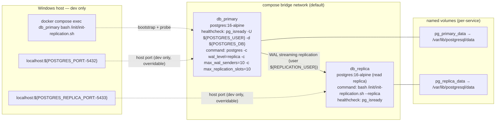
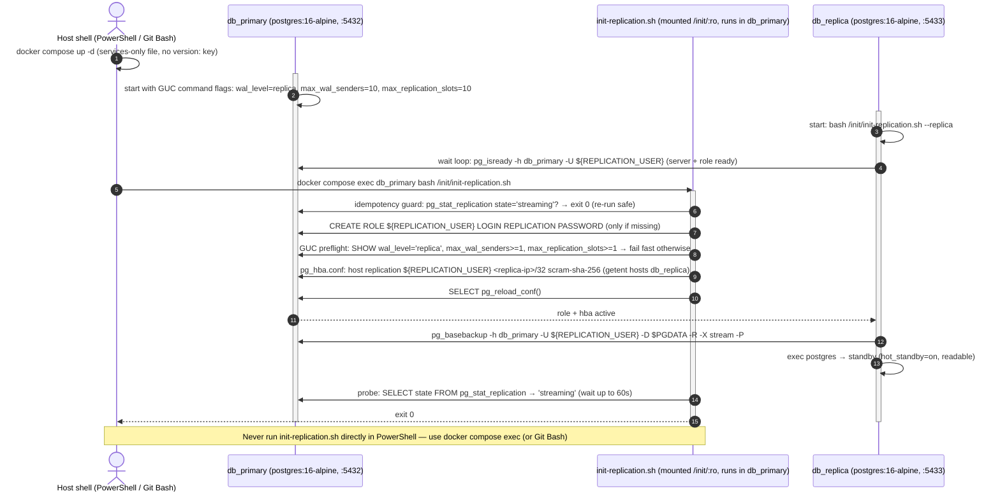
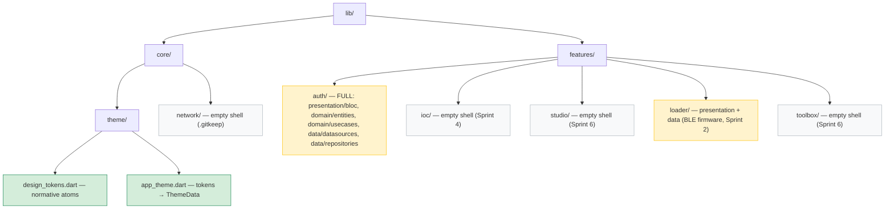

# Design: Sprint 0 Scaffold — Flutter Clean Architecture Shell, Design Tokens & PostgreSQL Streaming Replication

**Change**: `sprint-0-scaffold` · **Inputs**: `spec.md` (all decisions resolved: C1 hybrid tree, C2 FastAPI pin, tokens, compose pair, bootstrap, acceptance) · **Machine facts**: Docker 29.4.3 + Compose v5.1.3 (V2 plugin), Flutter SDK absent.

Sprint 0 delivers a **reproducible base with zero compile gates**: a hand-scaffolded hybrid feature tree with exactly two real Dart files (design tokens + theme), a services-only `docker-compose.yml` with an active physical streaming replica, and an idempotent dual-mode `init-replication.sh`. Acceptance is structure + Docker probes only — nothing gates on `flutter build/analyze`.

**Review path**: (1) Mermaid diagrams below (intent), (2) component definitions (the contract apply must implement), (3) decisions D-01…D-08 (rationale). Out of scope by spec: no feature code, no backend code, no `flutter create`, no commit/tag (apply/commit phases handle those).

---

## 1. Technical Approach

Three independent workstreams, verified by three probe families:

| Workstream | Deliverable | Verification (no build/analyze) |
|---|---|---|
| Flutter shell | `lib/core/{theme,network}` + 5 feature shells | Static path assertions |
| Visual atoms | `design_tokens.dart` + `app_theme.dart` | Read constants, assert hex + ≥48dp |
| Replication | `docker-compose.yml` + `init-replication.sh` + `.env.example` | `docker compose up -d` + `pg_isready` ×2 + `pg_stat_replication` + cross-SELECT |

## 2. Architecture Diagrams (Mermaid — per `config.yaml` rules.design)

### 2a. Compose topology — `db_primary` → `db_replica` streaming pair



**Notes**: no top-level `version:` key (Compose V2 obsolete — decision D-02). Internal ports stay 5432 on both; only host bindings differ. Replication travels over the bridge network, never through host ports. `init-replication.sh` is bind-mounted `:ro` into **both** containers at `/init/`.

### 2b. Replication bootstrap sequence — `init-replication.sh` (dual mode)



**Mechanism rationale (D-06)**: one container cannot stop/start a sibling's postgres without `docker.sock`/SSH — both rejected for a security thesis. Single script, two modes: `--replica` mode is db_replica's `command:` (self-basebackups, idempotent via `pg_controldata` standby check); default mode runs in db_primary (provision + probe). All required spec steps (role, wal_level, pg_hba, basebackup -R, start, probe) live in this one script.

### 2c. Flutter feature tree — hybrid layout (spec C1)



**Note**: `flutter create` is **not** run — SDK absent on this machine (probe 2026-08-17). IF the SDK appears before apply, a conditional step MAY run `flutter create .` to materialize `android/`/`windows/` platform folders; otherwise platform folders are deferred to Sprint 1. Empty dirs carry `.gitkeep` (git does not track dirs — decision D-07).

## 3. Component Definitions (exact Sprint 0 contract)

### 3.1 `lib/core/theme/design_tokens.dart` — Create

```dart
import 'package:flutter/material.dart';

/// Normative visual atoms. Single source of truth — the visual layer MUST NOT
/// alter security semantics (SoD lockouts etc.), only consume these tokens.
abstract final class DesignTokens {
  static const Color safetyRed = Color(0xFFDC3545);      // SoD lockouts
  static const Color warningYellow = Color(0xFFFFC107);  // calibration warnings
  static const Color govBlue = Color(0xFF0D6EFD);        // AI agent identity
  static const Color safeGreen = Color(0xFF198754);      // authorized access
  static const double tactileMinSize = 48.0;             // industrial tablets, >= 48dp
}
```

### 3.2 `lib/core/theme/app_theme.dart` — Create

`abstract final class AppTheme` with `static ThemeData light()` mapping:

| Token | ThemeData slot |
|---|---|
| `govBlue` | `colorScheme.primary` (also `ColorScheme.fromSeed(seedColor:)`) |
| `warningYellow` | `colorScheme.secondary` |
| `safetyRed` | `colorScheme.error` |
| `safeGreen` | `colorScheme.tertiary` |
| `tactileMinSize` | `materialTapTargetSize: MaterialTapTargetSize.padded`; `filledButtonTheme`/`visualDensity` minimum `Size(48,48)` |

### 3.3 `pubspec.yaml` — Create (minimal, hand-written)

```yaml
name: edge_ai_governance_iam_sod
description: Thesis monorepo — edge AI governance + IAM with separation of duties (Flutter frontend).
publish_to: none
version: 0.0.0
environment:
  sdk: ">=3.5.0 <4.0.0"
dependencies:
  flutter:
    sdk: flutter
dev_dependencies:
  flutter_lints: ^4.0.0
flutter:
  uses-material-design: true
```

No resolution runs (SDK absent); exact versions re-verified at the Sprint 1 gate when the SDK appears.

### 3.4 `docker-compose.yml` — Create (services-only; NO top-level `version:` key)

```yaml
services:
  db_primary:
    image: postgres:16-alpine
    command: ["postgres", "-c", "wal_level=replica", "-c", "max_wal_senders=10", "-c", "max_replication_slots=10"]
    environment:
      POSTGRES_USER: ${POSTGRES_USER:-postgres}
      POSTGRES_PASSWORD: ${POSTGRES_PASSWORD:?set POSTGRES_PASSWORD in .env}   # env only, never inline
      POSTGRES_DB: ${POSTGRES_DB:-edge_iam}
      REPLICATION_USER: ${REPLICATION_USER:-repl}
      REPLICATION_PASSWORD: ${REPLICATION_PASSWORD:?set REPLICATION_PASSWORD in .env}
    ports:
      - "${POSTGRES_PORT:-5432}:5432"          # dev only — override on 5432 collision (spec failure mode)
    volumes:
      - pg_primary_data:/var/lib/postgresql/data
      - ./init-replication.sh:/init/init-replication.sh:ro
    healthcheck:
      test: ["CMD-SHELL", "pg_isready -U $${POSTGRES_USER} -d $${POSTGRES_DB}"]   # $$ escapes compose interpolation
      interval: 5s
      timeout: 3s
      retries: 10
      start_period: 10s

  db_replica:
    image: postgres:16-alpine
    command: ["bash", "/init/init-replication.sh", "--replica"]
    environment:
      REPLICATION_USER: ${REPLICATION_USER:-repl}
      REPLICATION_PASSWORD: ${REPLICATION_PASSWORD:?set REPLICATION_PASSWORD in .env}
      PGPASSWORD: ${REPLICATION_PASSWORD:?set REPLICATION_PASSWORD in .env}       # non-interactive pg_basebackup
    ports:
      - "${POSTGRES_REPLICA_PORT:-5433}:5432"  # dev only — read replica
    volumes:
      - pg_replica_data:/var/lib/postgresql/data
      - ./init-replication.sh:/init/init-replication.sh:ro
    healthcheck:
      test: ["CMD-SHELL", "pg_isready"]
      interval: 5s
      timeout: 3s
      retries: 10
      start_period: 60s
    depends_on:
      db_primary:
        condition: service_healthy

volumes:
  pg_primary_data:
  pg_replica_data:
```

Secrets contract: `POSTGRES_PASSWORD` / `REPLICATION_PASSWORD` have **no inline defaults** (`:?` fails fast); non-secrets may default for dev ergonomics. Compose auto-reads `.env` (gitignored) — apply creates it from `.env.example`.

### 3.5 `init-replication.sh` — Create (POSIX bash, dual mode, idempotent)

Mounted `:ro` into both containers. Steps (mirrors §2b):

- **`--replica` mode** (db_replica `command:`):
  1. Wait loop: `pg_isready -h db_primary -U ${REPLICATION_USER}` up to N tries (10s apart).
  2. Idempotent restart guard: `pg_controldata "$PGDATA"` reports standby → `exec postgres` (no re-basebackup).
  3. `rm -rf "$PGDATA"/*` (first run: entrypoint skipped initdb — dir empty).
  4. `pg_basebackup -h db_primary -p 5432 -U ${REPLICATION_USER} -D "$PGDATA" -R -X stream -P -v` (`-R` writes `primary_conninfo` into `postgresql.auto.conf`).
  5. `exec postgres` → standby (PG16 default `hot_standby=on` → readable).
- **default mode** (inside db_primary, spec-mandated invocation):
  1. Container guard: `SELECT pg_is_in_recovery()` must be false (fail fast with hint if run on replica).
  2. Idempotency guard: `SELECT count(*) FROM pg_stat_replication WHERE state='streaming'` > 0 → `exit 0`.
  3. Create role if missing: `SELECT 1 FROM pg_roles WHERE rolname='${REPLICATION_USER}'` guard → `CREATE ROLE ... LOGIN REPLICATION PASSWORD ...`.
  4. GUC preflight: `SHOW wal_level`=`replica`, `SHOW max_wal_senders`≥1, `SHOW max_replication_slots`≥1 → else fail fast (GUCs applied declaratively by compose `command:` — decision D-05).
  5. pg_hba: `getent hosts db_replica` → replace existing replication line for `${REPLICATION_USER}` → append `host replication ${REPLICATION_USER} <replica-ip>/32 scram-sha-256` → `SELECT pg_reload_conf()` (IP recomputed every run → idempotent under compose network churn).
  6. Probe loop (≤60s): `pg_stat_replication.state='streaming'` → print status, `exit 0`; else `exit 1`.

**Windows invocation (spec)**: `docker compose exec db_primary bash /init/init-replication.sh` — never the script directly in PowerShell.

### 3.6 `.env.example` — Create (design addition required by env-only constraint)

```dotenv
POSTGRES_USER=postgres
POSTGRES_PASSWORD=change-me-dev
POSTGRES_DB=edge_iam
REPLICATION_USER=repl
REPLICATION_PASSWORD=change-me-dev-repl
POSTGRES_PORT=5432
POSTGRES_REPLICA_PORT=5433
```

### 3.7 `.gitignore` — Modify (append monorepo section; keep Flutter template)

```gitignore
# Sprint 0 — monorepo additions
.env
.venv/
node_modules/
database/
```

## 4. Atomic Design Mapping

| Atomic level | Sprint 0 status | Contents |
|---|---|---|
| **Tokens** (foundation) | ✅ Created | `DesignTokens` (colors, tactile size) + `AppTheme` wrapper — the atom export surface |
| **Atoms** | ✅ Created | Token constants only; no widget atoms yet |
| **Molecules** | ❌ NOT created | Composed components (e.g., labeled buttons, form fields) — arrive with feature UI (Sprint 1+) |
| **Organisms** | ❌ NOT created | Feature blocks (login screen, console layout) — arrive with `features/*` implementation |

Explicit non-goal: Sprint 0 ships **no widgets** — the visual system foundation is the token layer, so every future widget (Sprints 1/4/6) consumes `DesignTokens` and never raw hex.

## 5. Architecture Decisions

| # | Decision | Options considered | Choice & rationale |
|---|---|---|---|
| D-01 | Feature tree | layer-first (arch doc) vs feature-first (master doc) vs **hybrid** | Hybrid `lib/core/{theme,network}` + `lib/features/{auth,ioc,studio,loader,toolbox}` — spec C1 resolved; satisfies both ground-truth docs, scales to 5 apps |
| D-02 | Compose file | `version: "3"` key vs **services-only** | No top-level `version:` — obsolete in Compose v5.1.3 (V2), emits warning; spec C7 |
| D-03 | Port collision | hardcode 5432 vs **env override** | `${POSTGRES_PORT:-5432}` + symmetric `${POSTGRES_REPLICA_PORT:-5433}`; dev-only comment; spec failure mode: override, no code/secret change. Sprint 8 closes DB ports (out of scope) |
| D-04 | SDK absent | install SDK vs defer vs **hand-scaffold** | Hand-scaffold dirs + `.gitkeep` + minimal `pubspec.yaml`; conditional `flutter create` only if SDK appears; acceptance = structure (spec C3) |
| D-05 | GUC delivery | `ALTER SYSTEM SET` + restart vs **compose `command:` flags** | `-c wal_level=replica -c max_wal_senders=10 -c max_replication_slots=10` — restart-in-container kills PID 1 (anti-pattern); flags are restart-free and declarative; script preflights via `SHOW` |
| D-06 | Bootstrap orchestration | docker.sock mount / shared volume / SSH vs **dual-mode single script** | `init-replication.sh` with `--replica` mode as db_replica `command:` — no socket/volume/SSH (security thesis); all spec steps in one script, idempotent on both paths |
| D-07 | Empty dirs in git | skip vs README stubs vs **`.gitkeep`** | `.gitkeep` in every empty shell — minimal footprint, review-friendly |
| D-08 | Backend pin | Node/Express vs **FastAPI (Python)** | Spec C2: Sprints 3/5/6/7/9/10 are Python-native; **zero code impact in Sprint 0** — recorded as convention (`.venv/` ignored now); Express documented rollback |

## 6. File Changes

| File | Action | Description |
|---|---|---|
| `lib/core/theme/design_tokens.dart` | Create | Normative atoms (§3.1) |
| `lib/core/theme/app_theme.dart` | Create | Tokens → `ThemeData` (§3.2) |
| `lib/core/network/.gitkeep` | Create | Empty shell |
| `lib/features/{auth,ioc,studio,loader,toolbox}/**` | Create | Hybrid tree per §2c; auth full, loader presentation+data, rest shells (`.gitkeep`) |
| `pubspec.yaml` | Create | Minimal, hand-written (§3.3) |
| `docker-compose.yml` | Create | Services-only pair (§3.4) |
| `init-replication.sh` | Create | Dual-mode idempotent bootstrap (§3.5) |
| `.env.example` | Create | Env contract, no real secrets (§3.6) |
| `.gitignore` | Modify | Append monorepo section (§3.7) |

## 7. Interfaces / Contracts

- **Env contract** (compose → containers): `POSTGRES_USER`, `POSTGRES_PASSWORD`, `POSTGRES_DB`, `REPLICATION_USER`, `REPLICATION_PASSWORD`, `POSTGRES_PORT`, `POSTGRES_REPLICA_PORT`. Mandatory-without-default: the two passwords.
- **Token contract**: hex values and `tactileMinSize` are asserted by verify — exact match required.
- **Replication contract**: replica connects as `${REPLICATION_USER}` to `db_primary:5432` over the bridge network; primary requires `wal_level=replica`; replica readable via `hot_standby` (PG16 default).

## 8. Verification Alignment (spec acceptance → design support)

| Spec scenario | Design support | Verify approach (NO `flutter build/analyze` gates) |
|---|---|---|
| (a) structure — all 5 shells | D-01, §2c | Static path assertions: every `lib/features/*/{presentation,domain,data}` + auth sub-dirs + `lib/core/{theme,network}` exist |
| Token values asserted | §3.1 | Read `design_tokens.dart`; assert exact hex + `tactileMinSize >= 48.0` |
| Port 5432 collision | D-03, §3.4 comment | Optional: `POSTGRES_PORT=55432 docker compose up -d` succeeds without code/secret change |
| Streaming active | D-05/D-06, §2b | `docker compose up -d`; `pg_isready` on both; run `init-replication.sh` (then re-run — must `exit 0` idempotent); `pg_stat_replication` shows `state=streaming`; `INSERT` on primary → `SELECT` on replica |
| SDK absent | D-04 | Structure assertions only; `flutter` commands skipped when not on PATH |

`strict_tdd` stays false (no `pubspec.yaml` until apply); `sdd-init` re-run promotes it before Sprint 1.

## 9. Migration / Rollout

No data migration. Rollback: `docker compose down -v` (drops both named volumes) + `git clean` of created tree. Script is idempotent both ways — safe to re-run mid-bootstrap.

## 10. Open Questions

- [ ] `.env.example` dev passwords (`change-me-dev`) acceptable to reviewer, or placeholders only? (Env-only constraint forces SOME documented value; `:?` keeps real secrets out of compose.)
- [ ] Replication slot deliberately deferred (only `max_replication_slots` set) — revisit if replica restarts lose WAL in later sprints.
