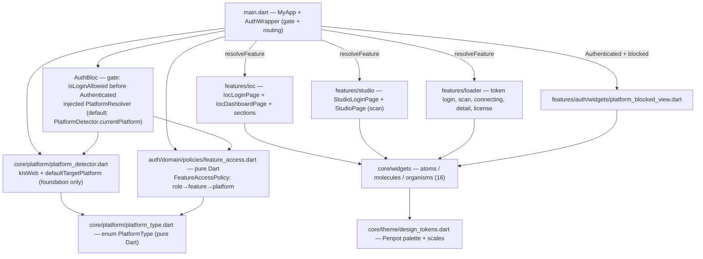
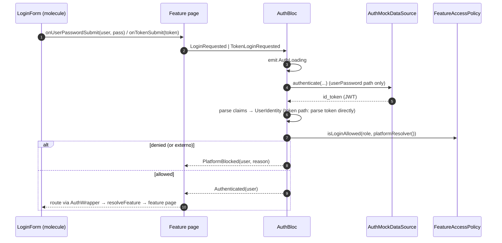
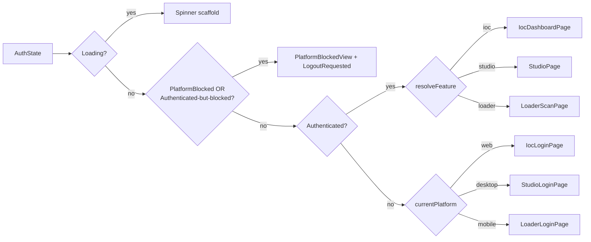

# Design: Sprint 1 UI Penpot — Penpot-driven UI, Platform Gates & Atomic Design

**Change**: `sprint-1-ui-penpot` · **Inputs**: `spec.md` (all decisions resolved: palette D1, matrix D2, studio scope, atomic structure) · **Machine facts**: Penpot MCP live palette verified 2026-08-18 (coral `#FC7E6C` dominant ×249 web, cream `#FFF3D8`, tan `#E5BE9D`, olive `#B7BE3A`, green `#00A461`, red `#D32F2F`; amber `#F9A825` = modal "Vincular Studio" buttons only), `flutter_bloc 8.1.3`, no new runtime deps.

Sprint 1 ports the three Penpot UIs onto a shared Atomic Design system with a security-first role→feature→platform gate enforced at login (AuthBloc) and at the route (AuthWrapper). The visual layer MUST NOT alter security semantics: the policy is pure Dart, the UI only reports it.

**Review path**: (1) Mermaid diagrams, (2) component contracts (the exact surface apply must implement), (3) decisions D-01…D-14. Apply must export each Penpot board to PNG via MCP as visual reference (spec dependency).

---

## 1. Technical Approach

Six workstreams in dependency order:

| # | Workstream | Deliverables | Verify |
|---|---|---|---|
| 1 | Tokens + platform | `design_tokens.dart`, `app_theme.dart`, `platform_type.dart`, `platform_detector.dart` | Token hex test, detector test |
| 2 | Policy + gate | `feature_access.dart`, `auth_bloc.dart` (PlatformBlocked, gate, TokenLoginRequested), mock `ext` activation, `platform_blocked_view.dart` | Policy unit tests, bloc_test |
| 3 | Shared widgets | `core/widgets/{atoms,molecules,organisms}` (16 widgets) | Widget tests |
| 4 | IOC web | Login + Dashboard shell + 4 sections per Penpot | Widget tests + routing test |
| 5 | Loader mobile + Studio desktop | 5 loader pages + `ble_device.dart`, 2 studio pages; delete `checklist_page.dart` | Widget tests |
| 6 | Test rewrites | tokens test, login_form test, integration test, auth_wrapper test | `flutter analyze` + `flutter test` |

Login UI is chosen by **platform, not role** (role is unknown pre-login): web→IOC login, desktop→Studio login, mobile→Loader token login. One `AuthBloc` serves all three.

## 2. Architecture Diagrams (Mermaid)

### 2a. Component architecture



### 2b. Login gate sequence (AuthBloc `LoginRequested` / `TokenLoginRequested`)



### 2c. AuthWrapper routing



## 3. Component Contracts (exact Sprint 1 surface)

### 3.1 `core/theme/design_tokens.dart` — Modify (palette pinned)

```dart
abstract final class DesignTokens {
  // Semantic palette (Penpot-derived). Names/semantics UNCHANGED (spec D1).
  static const Color govBlue = Color(0xFFFC7E6C);       // AI identity/brand → Penpot coral
  static const Color safetyRed = Color(0xFFD32F2F);     // SoD lockouts → Penpot red
  static const Color warningYellow = Color(0xFFB7BE3A); // calibration warnings → Penpot olive (RESOLVED)
  static const Color safeGreen = Color(0xFF00A461);     // authorized access → Penpot green
  // Surfaces (Penpot identity palette)
  static const Color surfaceCream = Color(0xFFFFF3D8);
  static const Color surfaceTan = Color(0xFFE5BE9D);
  // Scales (fidelity)
  static const double spaceXs = 4, spaceSm = 8, spaceMd = 16, spaceLg = 24, spaceXl = 32;
  static const double radiusSm = 4, radiusMd = 8, radiusLg = 12;
  static const double textXs = 10, textSm = 12, textMd = 14, textLg = 16, textXl = 20, textXl2 = 24;
  static const double tactileMinSize = 48.0;            // UNCHANGED, >= 48dp
}
```

NOT tokenized (D-12): amber `#F9A825` (modal "Vincular Studio" buttons — decorative) and `#22BD23` (bright-green status accents) — apply uses mapped tokens only. `app_theme.dart`: add `scaffoldBackgroundColor: DesignTokens.surfaceCream`; keep seed/primary→govBlue, secondary→warningYellow, error→safetyRed, tertiary→safeGreen; update comments.

### 3.2 `core/platform/` — Create

```dart
// platform_type.dart — pure Dart, NO imports
enum PlatformType { web, desktop, mobile }

// platform_detector.dart — foundation.dart ONLY (no dart:io anywhere)
import 'package:flutter/foundation.dart';
import 'platform_type.dart';
export 'platform_type.dart';           // detector still "exposes" the enum (spec)

abstract final class PlatformDetector {
  static PlatformType get currentPlatform {
    if (kIsWeb) return PlatformType.web;
    switch (defaultTargetPlatform) {
      case TargetPlatform.windows:
      case TargetPlatform.macOS:
      case TargetPlatform.linux:
      case TargetPlatform.fuchsia:
        return PlatformType.desktop;
      case TargetPlatform.android:
      case TargetPlatform.iOS:
        return PlatformType.mobile;
    }
  }
}
```

Testable via `debugDefaultTargetPlatformOverride` (foundation). `kIsWeb` is compile-time false in VM tests — the web branch is covered by the static "no dart:io" check (spec scenario).

### 3.3 `features/auth/domain/policies/feature_access.dart` — Create (pure Dart)

```dart
import '../../../../core/platform/platform_type.dart';  // pure Dart
import '../../entities/user_identity.dart';             // pure Dart

enum Feature { ioc, studio, loader }

abstract final class FeatureAccessPolicy {
  static const Map<UserRole, Feature> _roleToFeature = {
    UserRole.administrador: Feature.ioc, UserRole.superUsuario: Feature.ioc,
    UserRole.tecnico: Feature.studio, UserRole.operador: Feature.loader,
  };
  static const Map<Feature, Set<PlatformType>> _featureToPlatforms = {
    Feature.ioc: {PlatformType.web},
    Feature.studio: {PlatformType.desktop},
    Feature.loader: {PlatformType.mobile},
  };
  static Feature? resolveFeature(UserRole role) => _roleToFeature[role];
  static bool isLoginAllowed(UserRole role, PlatformType platform) {
    final f = resolveFeature(role);
    return f != null && _featureToPlatforms[f]!.contains(platform);
  }
}
```

Externo: no map entry → `resolveFeature` null → denied on every platform (spec scenario).

### 3.4 `features/auth/presentation/bloc/auth_bloc.dart` — Modify (gate)

```dart
typedef PlatformResolver = PlatformType Function();

class PlatformBlocked extends AuthState {          // NEW state (additive, spec D5)
  final UserIdentity user;
  final String reason;                              // UI copy, Spanish ok
  const PlatformBlocked({required this.user, required this.reason});
  @override List<Object?> get props => [user, reason];
}

class TokenLoginRequested extends AuthEvent {       // NEW event (Loader token login)
  final String token;
  const TokenLoginRequested({required this.token});
  @override List<Object?> get props => [token];
}

class AuthBloc extends Bloc<AuthEvent, AuthState> {
  AuthBloc({AuthMockDataSource? authDataSource, PlatformResolver? platformResolver})
      : _authDataSource = authDataSource ?? AuthMockDataSource(),
        _platformResolver = platformResolver ?? PlatformDetector.currentPlatform,
        super(const AuthInitial()) { /* handlers unchanged + on<TokenLoginRequested> */ }

  // In _onLoginRequested, AFTER parsing user (before emit Authenticated):
  //   final platform = _platformResolver();
  //   if (!FeatureAccessPolicy.isLoginAllowed(user.rol, platform)) {
  //     emit(PlatformBlocked(user: user, reason: 'Acceso denegado: su rol requiere la plataforma ${platform.name}.'));
  //     return;
  //   }
  //   emit(Authenticated(user: user));
  // _onTokenLoginRequested: emit AuthLoading; parse JWT claims (reuse _parseJwtPayload);
  //   build UserIdentity; same gate as above; invalid token → AuthError.
}
```

- Gate placement: **after** datasource authentication, **before** `Authenticated` (spec). Bad credentials still → `AuthError`; externo now reaches the gate (D-08: mock `ext` `active: true` — the policy, not the datasource, is the single role-denial point).
- `PlatformBlocked` is additive — existing `AuthState` consumers and tests stay compatible.

### 3.5 `features/auth/presentation/widgets/platform_blocked_view.dart` — Create

`PlatformBlockedView({required String username, required String message, required VoidCallback onLogout})` — Scaffold with govBlue lock icon, message, `AppButton` "Cerrar Sesión" → `onLogout`. Used by AuthWrapper for BOTH login-denial (`PlatformBlocked` state) and route-guard (Authenticated + mismatch) paths.

### 3.6 `core/widgets/atoms/` — Create (5 files, one widget each)

| Widget | Contract (props) | Tokens |
|---|---|---|
| `AppButton` | `label, onPressed, {variant: filled\|outlined\|text, icon, loading, color, enabled}` — min `Size(48,48)`, spinner when loading | govBlue default; safeGreen/safetyRed override; radiusMd |
| `AppTextField` | `controller, label, {hint, obscureText, prefixIcon, validator, enabled, onSubmitted}` — wraps `TextFormField`, OutlineInputBorder radiusMd | govBlue focus, surfaceCream bg |
| `StatusBadge` | `label, tone: {success, warning, danger, neutral, brand}` — pill, tone bg @10% + fg | safeGreen / warningYellow / safetyRed / grey / govBlue |
| `TokenChip` | `label, {icon, color, onDeleted}` — small chip | defaults govBlue |
| `ProgressBar` | `value, {color, minHeight}` — wraps LinearProgressIndicator | defaults safeGreen/warningYellow per context |

### 3.7 `core/widgets/molecules/` — Create (6 files)

| Widget | Contract |
|---|---|
| `LoginForm` | `{variant: LoginVariant.userPassword \| token, isLoading, errorMessage, onUserPasswordSubmit(String user, String pass)?, onTokenSubmit(String token)?, buttonLabel}` — **controlled** (no bloc import); userPassword = Usuario/Contraseña fields; token = single token field; local Form validation; errorMessage rendered inline (StatusBadge danger). REPLACES the inline `LoginPage` in main.dart (spec scenario). |
| `StatCard` | `{title, value, icon, color, onTap?}` — value 24px bold in color |
| `NavItem` | `{icon, label, selected, onTap, badge?}` — selected = white bg tint |
| `ChecklistCard` | `{title, description, isCritical, isCompleted, onToggle}` — tactile 48×48 checkbox, CRÍTICO badge (safetyRed). Built per spec inventory; consumed by tests now, Loader production-checklist in Sprint 2 (D-11). |
| `DeviceCard` | `{device (BleDevice), onTap, actions?}` — name, MAC, StatusBadge(estado); optional trailing actions (Studio) |
| `PageHeader` | `{title, subtitle?, actions?, searchHint?, onSearchChanged?}` |

`enum LoginVariant { userPassword, token }` lives in `login_form.dart`.

### 3.8 `core/widgets/organisms/` — Create (5 files)

| Widget | Contract |
|---|---|
| `SideNavigation` | `{items: List<NavItemData{icon,label}>, selectedIndex, onSelect, username, roleLabel, avatarInitials, onLogout}` — 250px govBlue column, header + logout |
| `TopBar` | `{title, subtitle?, searchHint?, onSearchChanged?, actions?}` — white bar, 24px bold title |
| `DataTable` | `{columns: List<DataTableColumn{label, flex}>, rows: List<DataTableRow{cells: List<Widget>, actions: List<Widget>?}>}` — generic header + scrollable body |
| `ActionBar` | `{primaryLabel, onPrimary, primaryEnabled, primaryColor?, secondaryLabel?, onSecondary?}` — bottom bar, ≥48dp buttons |
| `DeviceDetailPanel` | `{device: BleDevice}` — Familia/Modelo, Estado conexión (StatusBadge), Hardware, MAC, Nombre, Modificada por, Voltaje/Temperatura, Autorizada/Congelada |

### 3.9 Feature pages (per Penpot)

| Penpot board | Page/widget | Composed of |
|---|---|---|
| web `Login` | `features/ioc/presentation/pages/ioc_login_page.dart` | LoginForm(userPassword) + BlocConsumer (AuthError→errorMessage) |
| web `Home`/`Personal y Accesos`/`Gestion de eventos` | `ioc_dashboard_page.dart` (shell: SideNavigation nav = Dashboard, Gestión de Accesos, Personal y Accesos, Gestion de eventos; TopBar; IndexedStack) + `sections/{dashboard,access_management,personal_accesses,events}_section.dart` | Dashboard: StatCard×4 (Métricas Globales), DataTable (Registros de entradas Autorizadas), alerts list w/ StatusBadge danger (Alertas de Seguridad — Bloqueados), static 7-bar traffic placeholder; Accesos: DataTable users (current mock); Personal: usuario institucional card, equipos vinculados (DeviceCard), Estatus Global, Acciones Maestras buttons (Vincular Studio/Vincular Android → SnackBar, no modal — out of scope); Eventos: "En desarrollo" card. Logout wired to `LogoutRequested` (D-13, fixes current TODO) |
| escritorio `Login` | `features/studio/presentation/pages/studio_login_page.dart` | LoginForm(userPassword), button "INICIAR SESION" |
| escritorio `ScanScreen` | `features/studio/presentation/pages/studio_page.dart` (routing target `StudioPage`) | TopBar("Studio") + logout; scan section: AppButton "Escanear" (toggle, disabled while scanning), scanning spinner state, DataTable (Dispositivo, Estado badge, Puerto, Adaptador, Acciones: Editar/Validación/Despliegue/Conectar-Desconectar icons); local mock device list (no real BLE — out of scope) |
| movile `Login` | `features/loader/presentation/pages/loader_login_page.dart` | LoginForm(token) → `TokenLoginRequested` |
| movile `Scan` | `features/loader/presentation/pages/scan_page.dart` (routing target for Loader) | "Buscar dispositivos" AppButton, "Dispositivos cercanos" DeviceCard list (mock PLCs, MACs like `C1:51:53:9E:6A:17`), Escaneando…/Cancelar state; tap device → `Navigator.push` ConnectingPage |
| movile `Conectando…` | `connecting_page.dart` | ProgressBar + "Conectando…", auto-advance (delayed) to DeviceDetailPage |
| movile `Home` | `device_detail_page.dart` | DeviceDetailPanel; if `device.licenseExpired` → LicenseExpiredPage (spec scenario) |
| movile license | `license_expired_page.dart` | message + AppButton back |

Model: `features/loader/domain/entities/ble_device.dart` — Create, pure Dart: `BleDevice{name, mac, model, family, hardware, connectionState (enum: disconnected|connecting|connected), modifiedBy, voltage, temperature, authorized (bool), licenseExpired (bool)}`. `checklist_page.dart` — Delete (superseded, D-11).

### 3.10 `main.dart` — Modify

Remove inline `LoginPage` (spec scenario). `AuthWrapper` implements §2c: loading spinner → blocked paths (`state is PlatformBlocked` OR `Authenticated && !FeatureAccessPolicy.isLoginAllowed(user.rol, PlatformDetector.currentPlatform)`) → `PlatformBlockedView(onLogout: LogoutRequested)`; allowed → `resolveFeature` switch (ioc→`IocDashboardPage(currentUser:)`, studio→`StudioPage(currentUser:)`, loader→`LoaderScanPage()`); unauthenticated → platform switch login router.

## 4. Architecture Decisions

| # | Decision | Options | Choice & rationale |
|---|---|---|---|
| D-01 | Palette values | re-token Penpot vs keep Flutter values vs **map Penpot→semantic tokens** | Spec-resolved; pinned §3.1. govBlue=coral `#FC7E6C`, safetyRed=`#D32F2F`, warningYellow=olive `#B7BE3A` (**RESOLVED**: olive is the cross-page accent — amber `#F9A825` is modal-button-only, rejected D-12), safeGreen=`#00A461`; surfaces cream/tan; names/semantics unchanged |
| D-02 | Role→feature→platform matrix | (spec) | admin/super→IOC web; tecnico→Studio desktop; operador→Loader mobile; externo→none |
| D-03 | Studio scope | scaffold vs defer | In scope: login + scan only (spec) |
| D-04 | Atomic structure | `core/widgets/{atoms,molecules,organisms}` | Spec-resolved; feature views stay in features |
| D-05 | `PlatformType` location | in detector (imports foundation) vs **own pure-Dart file** | `platform_type.dart` + detector re-exports it — `feature_access.dart` stays Flutter-free (spec requires BOTH pure policy AND detector exposing enum) |
| D-06 | Login UI selection | role-based (impossible pre-login) vs **platform-based** | Three login UIs (web/desktop/mobile) selected by `currentPlatform`; one AuthBloc |
| D-07 | Loader token login | new event vs extend LoginRequested | `TokenLoginRequested` parses JWT claims directly (no datasource) — mock OIDC semantics |
| D-08 | Mock `ext` user | keep inactive vs **activate** | `active: true` so externo reaches the policy gate → `PlatformBlocked` (spec scenario); single role-denial point |
| D-09 | Blocked UX | reuse `AuthError` vs **dedicated state + shared view** | `PlatformBlocked{user,reason}` + `PlatformBlockedView`; wrapper unifies login-denial and route-guard |
| D-10 | IOC nav | keep old 5 items vs **Penpot nav** | Dashboard / Gestión de Accesos / Personal y Accesos / Gestion de eventos; sections in `sections/` files (569-line page split) |
| D-11 | Legacy `ChecklistPage` | keep vs **delete** | Deleted (not in Penpot flow); `ChecklistCard` molecule still built per spec for Sprint 2 reuse |
| D-12 | Amber/bright-green | tokenize vs **reject** | `#F9A825`/`#22BD23` not tokenized — decorative accents; apply uses mapped tokens |
| D-13 | IOC logout | TODO no-op vs **wire LogoutRequested** | Wired — required for wrapper round-trip |
| D-14 | Bloc testability | global `debugDefaultTargetPlatformOverride` vs **injected `PlatformResolver`** | Constructor-injected `PlatformType Function()` defaulting to `PlatformDetector.currentPlatform`; widget tests still use the foundation override for AuthWrapper |

## 5. File Changes

| File | Action | Description |
|---|---|---|
| `lib/core/theme/design_tokens.dart` | Modify | Palette §3.1 + surfaces + scales |
| `lib/core/theme/app_theme.dart` | Modify | surfaceCream scaffold bg, comments |
| `lib/core/platform/platform_type.dart` | Create | `enum PlatformType` (pure Dart) |
| `lib/core/platform/platform_detector.dart` | Create | kIsWeb + defaultTargetPlatform; re-exports enum |
| `lib/features/auth/domain/policies/feature_access.dart` | Create | Policy §3.3 |
| `lib/features/auth/presentation/bloc/auth_bloc.dart` | Modify | PlatformBlocked, gate, TokenLoginRequested, resolver |
| `lib/features/auth/data/datasources/auth_mock_datasource.dart` | Modify | `ext` active:true |
| `lib/features/auth/presentation/widgets/platform_blocked_view.dart` | Create | §3.5 |
| `lib/core/widgets/atoms/{app_button,app_text_field,status_badge,token_chip,progress_bar}.dart` | Create | §3.6 |
| `lib/core/widgets/molecules/{login_form,stat_card,nav_item,checklist_card,device_card,page_header}.dart` | Create | §3.7 |
| `lib/core/widgets/organisms/{side_navigation,top_bar,data_table,action_bar,device_detail_panel}.dart` | Create | §3.8 |
| `lib/main.dart` | Modify | §3.10; delete inline LoginPage |
| `lib/features/ioc/presentation/pages/ioc_login_page.dart` | Create | web login |
| `lib/features/ioc/presentation/pages/ioc_dashboard_page.dart` | Modify | Shell refactor (D-10) |
| `lib/features/ioc/presentation/pages/sections/{dashboard,access_management,personal_accesses,events}_section.dart` | Create | §3.9 |
| `lib/features/loader/domain/entities/ble_device.dart` | Create | Model |
| `lib/features/loader/presentation/pages/{loader_login_page,scan_page,connecting_page,device_detail_page,license_expired_page}.dart` | Create | §3.9 |
| `lib/features/loader/presentation/pages/checklist_page.dart` | Delete | Superseded (D-11) |
| `lib/features/studio/presentation/pages/{studio_login_page,studio_page}.dart` | Create | §3.9 |
| `test/core/theme/design_tokens_test.dart` | Modify | New hexes + scales |
| `test/core/platform/platform_detector_test.dart` | Create | Override mapping |
| `test/features/auth/domain/policies/feature_access_test.dart` | Create | Matrix unit tests |
| `test/features/auth/presentation/bloc/auth_bloc_test.dart` | Create | bloc_test gate scenarios |
| `test/features/auth/presentation/widgets/platform_blocked_view_test.dart` | Create | Message + logout |
| `test/widget/login_form_test.dart` | Rewrite | Real molecule, both variants |
| `test/core/widgets/widgets_test.dart` | Create | Shared component tests |
| `test/widget/auth_wrapper_test.dart` | Create | Routing + gate (override platform) |
| `integration_test/auth_integration_test.dart` | Rewrite | Matrix flows |

## 6. Testing Strategy

| Layer | What | Approach |
|---|---|---|
| Unit | Policy matrix (4 roles × 3 platforms + externo), detector mapping, token parse | Pure tests; `debugDefaultTargetPlatformOverride` (+ reset in teardown) |
| Bloc | Allowed→Authenticated; denied→PlatformBlocked; externo→PlatformBlocked; bad creds→AuthError; logout | `bloc_test` with injected `PlatformResolver` |
| Widget | Atoms/molecules/organisms (render, callbacks, ≥48dp), LoginForm variants + validation, PlatformBlockedView logout, AuthWrapper routing matrix | `testWidgets`; AuthWrapper via real bloc + platform override |
| Integration | `auth_integration_test.dart`: force `TargetPlatform.windows` at start → admin blocked, tecnico→Studio; force `android` → operador→Loader; force `web` not possible on host — web path covered by widget tests | Rewrite (spec) |

Stale rewrites: `login_form_test.dart` fake removed; integration test's non-existent keys (`username_field`, `inject_firmware_button`, 'Studio Admin') replaced by new flows.

## 7. Verification Alignment (spec acceptance → design support)

| Spec scenario | Design support |
|---|---|
| Token hexes + tactileMinSize | §3.1; `design_tokens_test.dart` updated |
| Detector web/desktop/mobile + no dart:io | §3.2; static import scan + override tests |
| Policy matrix + externo | §3.3; `feature_access_test.dart` |
| Bloc gate incl. externo/bad-creds | §3.4 + D-08; `auth_bloc_test.dart` |
| Wrapper defense-in-depth + logout + routing | §3.10 + D-13; `auth_wrapper_test.dart` |
| LoginPage extracted; shared reuse | §3.6–3.9; widget tests assert composition |
| IOC/Studio/Loader screens per Penpot | §3.9 mapping; PNG export during apply |
| Test rewrites green | Workstream 6 |

## 8. Migration / Rollout

No data migration. Rollback: per-sprint commits (`feat(sprint-1): ...` v0.1.0 + tag) keep units reversible — token change, bloc gate, widget system, and studio scaffold are independent commits; studio drop-safe if defective. `AuthCheckRequested` stays non-persistent (spec constraint).

## 9. Open Questions

- [ ] IOC "Acciones Maestras" (Vincular Studio/Vincular Android): static buttons with SnackBar placeholder acceptable, or hidden until the modal work in a later sprint? (Proposal says modal behavior out of scope — design assumes SnackBar.)
- [ ] Traffic placeholder: static 7-bar graphic without a chart dependency — confirm acceptable to reviewer.